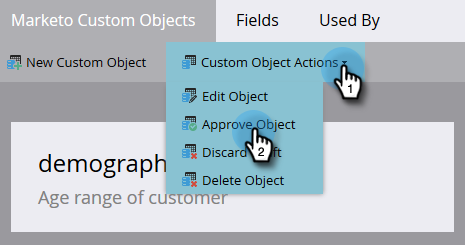

# Approve a Custom Object {#approve-a-custom-object}

Approve a Custom Object - Marketo Docs - Product Documentation

You must approve a custom object before you can use it. The process is slightly different for new custom objects and ones that you've edited.

### What's in this article? {#what-s-in-this-article}

[Approve a New Custom Object](#approveacustomobject-approveanewcustomobject)  
[Approve an Edited Custom Object](#approveacustomobject-approveaneditedcustomobject)

#### Approve a New Custom Object {#approveacustomobject-approveanewcustomobject}

You've created a brand new custom object. Here's how to approve it.

##### 1. In Admin, click Marketo Custom Objects and select an object that's in a Draft state. {#approveacustomobject-inadmin-clickmarketocustomobjectsandselectanobjectthat'sinadraftstate.}

##### 2. Click the Custom Object Actions drop-down and select Approve Object. {#approveacustomobject-clickthecustomobjectactionsdrop-downandselectapproveobject.}

##### 3. The state changes to Approved. {#approveacustomobject-thestatechangestoapproved.}

>[!NOTE]
>
>A custom object used in a *one-to-many structure* must have at least one dedupe field, a link field, a linked object name, and a linked field name to be approved.
>
>A custom object used in a *many-to-many structure* **doesn't** need a link field, linked object name, or a linked field name when you approve it (because they live in the intermediary object).
>
>A custom object used as an *intermediary object* `requires a link field, linked object name, and linked field name but`**doesn't** require a dedupe field.
>
>See [Understanding Marketo Custom Objects](understanding-marketo-custom-objects.md) for more information.

That's it! Now, you can select your custom object in the constraints of your filters and triggers to use in your campaigns. 

#### Approve an Edited Custom Object {#approveacustomobject-approveaneditedcustomobject}

After you edit an approved custom object, you must approve the draft to return the custom object to an Approved state.

##### 1. When you edit an already approved custom object, it receives an Approved with Draft state. {#approveacustomobject-whenyoueditanalreadyapprovedcustomobject-itreceivesanapprovedwithdraftstate.}

##### 2. When you're ready to approve the draft, click the Custom Object Actions drop-down and select Approve Object. {#approveacustomobject-whenyou'rereadytoapprovethedraft-clickthecustomobjectactionsdrop-downandselectapproveobject.}

##### 3. A preview displays the items that were changed in the draft. Click Approve. {#approveacustomobject-apreviewdisplaystheitemsthatwerechangedinthedraft.clickapprove.}

