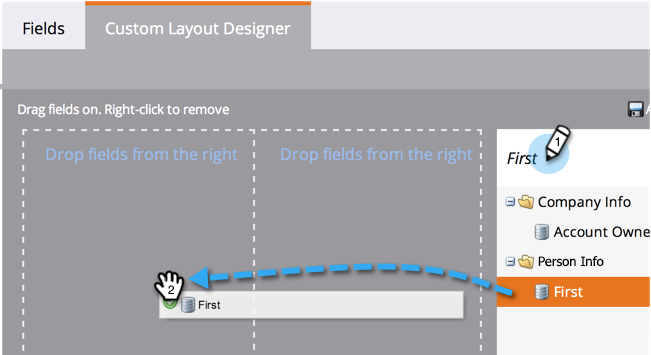

# Creating a Custom Tab for the Person Detail Page {#creating-a-custom-tab-for-the-person-detail-page}

Creating a Custom Tab for the Person Detail Page - Marketo Docs - Product Documentation

>[!NOTE]
>
>**FYI**
>
>Marketo is now standardizing language across all subscriptions, so you may see lead/leads in your subscription and person/people in docs.marketo.com. These terms mean the same thing; it does not affect article instructions. There are some other changes, too. [Learn more](http://docs.marketo.com/display/DOCS/Updates+to+Marketo+Terminology).

If you find yourself looking for a specific set of fields in the person detail over and over again, consider creating a custom layout to make things easier.

1. Go to **Admin** and click **Field Management**.

   

1. Click the **Custom Layout Designer** tab.

   

1. Find a field you want to add, then drag and drop it into the canvas.

   

1. Continue adding fields until you have the layout the way you want it.

   

   >[!NOTE]
   >
   >You have two columns to work with.

   ##### If you decide you want to remove a field, right-click the field you want to remove and click Delete. {#creatingacustomtabforthepersondetailpage-ifyoudecideyouwanttoremoveafield-right-clickthefieldyouwanttoremoveandclickdelete.}

   

   Awesome work! Now when you load a person's details, you can use your custom layout to access the information important to you.

   

