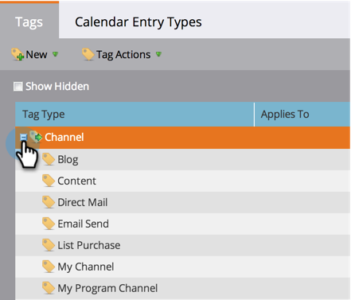
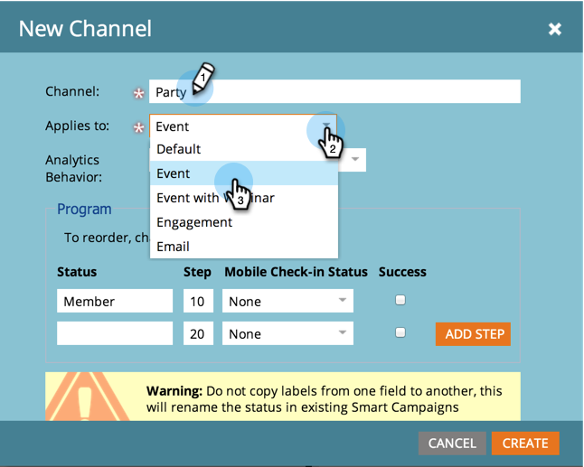

# Create a Program Channel {#create-a-program-channel}

Create a Program Channel - Marketo Docs - Product Documentation

A program is one specific marketing initiative. The channel is intended to be the delivery mechanism, like Webinar or Sponsorship or Online Ad.

>[!NOTE]
>
>**Admin Permissions Required**

>[!NOTE]
>
>**Deep Dive**
>
>`Learn more about` [programs](../../../../welcome-to-marketo-docs/product-docs/core-marketo-concepts/programs.md) `, the most important element in Marketo.`

1. Under the **Admin** section, click **Tags**.

   

   >[!NOTE]
   >
   >Why tags? A channel is a way of describing a program, just like other tags. The channel just has special extra features.

1. Click the **+** sign next to **Channel** to expand and see existing channels.

   

1. Under **New**, click **New Channel**.

   

   >[!NOTE]
   >
   >**Example**
   >
   >
   >Channel: Billboard
   >
   >    
   >    
   >    * Apply to: Default
   >    * Progression: Member, Engaged (If in doubt, these work fine)
   >    * Success: Engaged
   >    
   >    
   >Channel: Party
   >
   >    
   >    
   >    * Apply to: Event
   >    * Progression: Invited, Registered, No Show and Attended
   >    * Success: Attended
   >    
   >    
   >Check out the Progressions of existing channels to get an idea of how to use them.

1. Let's go with the Party channel example. Name your new **Channel** and select the program type it will apply to.

   

   >[!NOTE]
   >
   >`Apply to what? There are several types of programs. Match the channel to the right type. If in doubt, choose`**Default** `.`

   >[!NOTE]
   >
   >When using "Event with Webinar," system mappings will be locked (as required by webinar integrations) and cannot be edited.

   Enter the first two program **Status** names, then click **Add Step**.
   

1. Enter another program **Status** and **Step** number, then click **Add Step**.

   

   >[!TIP]
   >
   >`The`**Step** `number is used for sorting of program statuses. Keep in mind that people cannot go backwards in these progression steps. They can only change status to a higher or equal value status. Use the equal values when statuses are intended to switch back and forth as opposed to a progression.`

1. Enter the last program **Status** and **Step** number.

   

   >[!NOTE]
   >
   >When using the type "Event," system mapping for Registered, Waitlisted, and Attended statuses is required. As such, those statuses cannot be hidden.

1. Pick the **Mobile Check-in Status** for **Registered**.

   

1. Pick the **Mobile Check-in Status** for **Attended**.

   

   >[!NOTE]
   >
   >**Mobile Check-in Status** `** **options will only be available if the channel will be for event programs.`

   >[!NOTE]
   >
   >**Reminder**
   >
   >
   >`Only people with a`**Mobile Check-in Status** `** **of`**Registered** `and`**Attended** `will be visible in the` [Mobile Check-in Apps](../../../../welcome-to-marketo-docs/product-docs/demand-generation/events.md) `.`

   >[!TIP]
   >
   >If a new person is created in the mobile check-in app, it will be set to Registered in the event program. If a person is checked into the event on the app, it will be set to Attended in the event program.

1. Select the **Success** program status, then click **Create**.

   

   Nicely done! When you make a new program of that type, this new channel will be one of the choices.

