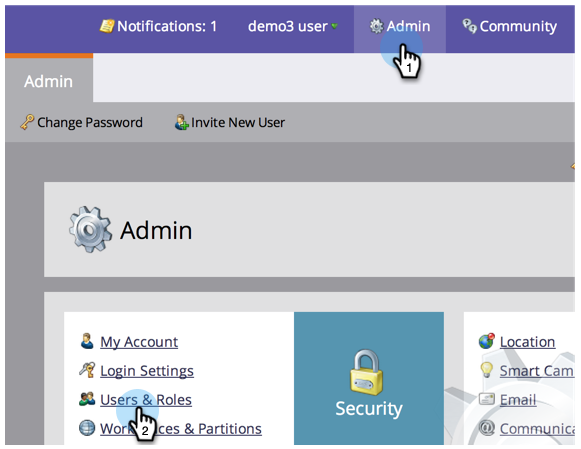
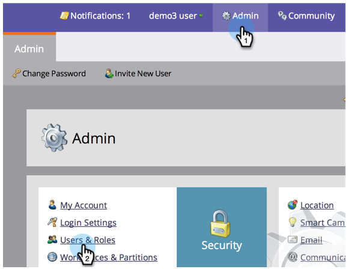
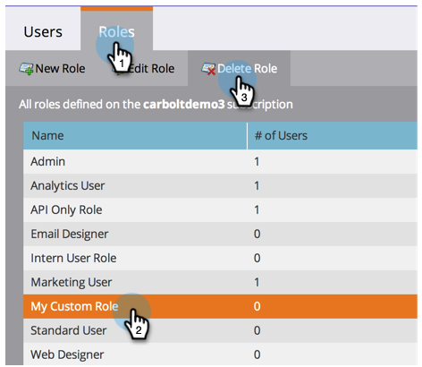

# Create, Delete, Edit and Change a User Role {#create-delete-edit-and-change-a-user-role}

Create, Delete, Edit and Change a User Role - Marketo Docs - Product Documentation

**Roles** group together a bunch of permissions. **Permissions** allow you to do stuff in Marketo. You assign a **role** to a user. Easy as pie.

>[!NOTE]
>
>**Admin Permissions Required**

### What's in this article? {#what-s-in-this-article}

[Create a Role](#create-delete-editandchangeauserrole-createarole)  
[Delete a Role](#create-delete-editandchangeauserrole-deletearole)  
[Edit an Existing Role](#create-delete-editandchangeauserrole-editanexistingrole)  
[Change a User's Role](#create-delete-editandchangeauserrole-changeauser'srole)

#### Create a Role {#create-delete-editandchangeauserrole-createarole}

##### 1. Go to Admin and click Users & Roles. {#create-delete-editandchangeauserrole-gotoadminandclickusers&roles.}

  

##### 2. Go to the Roles tab and click New Role. {#create-delete-editandchangeauserrole-gototherolestabandclicknewrole.}

  

##### 3. Name your new role, check all the permissions you want to grant to users associated with the role, and click Create. {#create-delete-editandchangeauserrole-nameyournewrole-checkallthepermissionsyouwanttogranttousersassociatedwiththerole-andclickcreate.}

 

#### Delete a Role {#create-delete-editandchangeauserrole-deletearole}

##### 1. Under Admin, click Users & Roles. {#create-delete-editandchangeauserrole-underadmin-clickusers&roles.}

  

##### 2. Under the Roles tab, select a role and click Delete Role. {#create-delete-editandchangeauserrole-undertherolestab-selectaroleandclickdeleterole.}

  

##### 3. Confirm the deletion by clicking Delete. {#create-delete-editandchangeauserrole-confirmthedeletionbyclickingdelete.}

>[!NOTE]
>
>You must first ensure that no users are assigned to a role, otherwise it cannot be deleted.

#### Edit an Existing Role {#create-delete-editandchangeauserrole-editanexistingrole}

>[!NOTE]
>
>To edit your own user role, you'll have to log in as another user with Admin rights.

##### 1. Go to Admin and click Users & Roles. {#create-delete-editandchangeauserrole-gotoadminandclickusers&roles..1}

  

##### 2. Click the Roles tab. {#create-delete-editandchangeauserrole-clicktherolestab.}

  

##### 3. Select the role you want to edit and click Edit Role. {#create-delete-editandchangeauserrole-selecttheroleyouwanttoeditandclickeditrole.}

  

##### 4. Make all the changes you need and click Save. {#create-delete-editandchangeauserrole-makeallthechangesyouneedandclicksave.}

>[!NOTE]
>
>The changes made to the role will affect every user associated to this role.

>[!TIP]
>
>Are you looking to update the account email address? [Learn how here](http://docs.marketo.com/x/3wFI).

#### Change a User's Role {#create-delete-editandchangeauserrole-changeauser'srole}

##### 1. Go to Admin and click Users & Roles. {#create-delete-editandchangeauserrole-gotoadminandclickusers&roles..2}

  

##### 2. Select the user you want to assign a different role to and click Edit User. {#create-delete-editandchangeauserrole-selecttheuseryouwanttoassignadifferentroletoandclickedituser.}

  

##### 3. Uncheck the previous role, select the new one, then click Save. {#create-delete-editandchangeauserrole-uncheckthepreviousrole-selectthenewone-thenclicksave.}

>[!NOTE]
>
>If you leave multiple roles selected, Marketo will default to the most restrictive permission.

`Awesome, now you are really are on a roll! (Get it?)` 