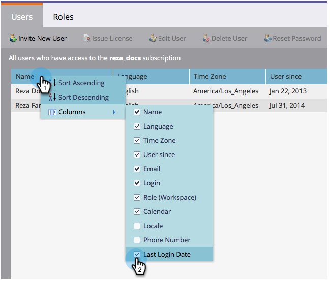

# Export a List of Users and Roles {#export-a-list-of-users-and-roles}

Export a List of Users and Roles - Marketo Docs - Product Documentation

>[!NOTE]
>
>**Admin Permissions Required**

It's pretty easy to export a full list of your users and user roles. Here's how.

1. Go to **Admin**.

   

1. Click **Users & Roles**.

   

1. Add/remove any columns you want before exporting.

   >[!TIP]
   >
   >`To export roles, go to the`**Roles** `** **tab first then export.`

   

1. Click the **Export **icon.

   

   And that's all folks! You should be downloading the new Excel file.

   

