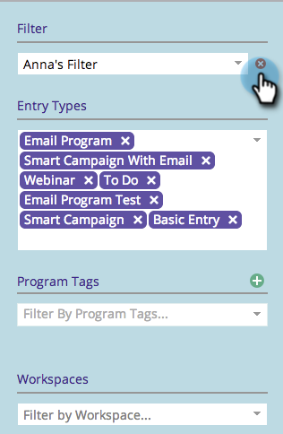

# Deleting a Filter in the Marketing Calendar {#deleting-a-filter-in-the-marketing-calendar}

Deleting a Filter in the Marketing Calendar - Marketo Docs - Product Documentation

If you're looking to delete a filter in the Marketing Calendar, you've come to the right place.

1. Select the filter you'd like to delete. 

   

1. Click the red **x**. 

   

1. Click **Delete** to confirm.

   

   Bye-bye.

