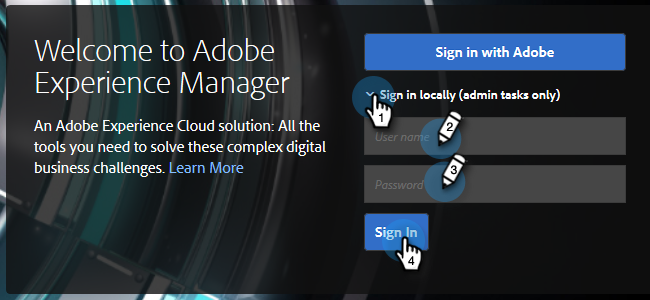
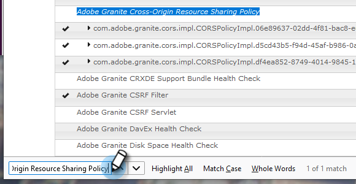
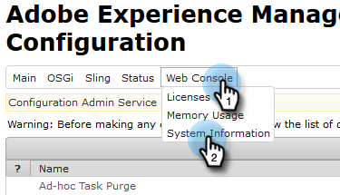

# Configuring Adobe Experience Manager Integration {#configuring-adobe-experience-manager-integration}

Configuring Adobe Experience Manager Integration - Marketo Docs - Product Documentation

Configure AEM so you can access, select, and import AEM assets into Marketo's Design Studio.

>[!NOTE]
>
>**Admin Permissions Required**

>[!CAUTION]
>
>Currently, this feature is only fully supported in Firefox. It is not supported in Safari, and it might not work in the latest version of Chrome (v. 80), depending on your SameSite cookie settings.

##### 1. Navigate to the Adobe Experience Manager (the URL is specific to your company). {#configuringadobeexperiencemanagerintegration-navigatetotheadobeexperiencemanager(theurlisspecifictoyourcompany).}

##### 2. You can sign in with Adobe or sign in locally. In this example we'll sign in locally. {#configuringadobeexperiencemanagerintegration-youcansigninwithadobeorsigninlocally.inthisexamplewe'llsigninlocally.}

##### 3. In Tools, click Operations and select Web Console. {#configuringadobeexperiencemanagerintegration-intools-clickoperationsandselectwebconsole.}

##### 4. In your browser, search (ctrl+f on Windows, cmd+f on Mac) for "Adobe Granite Cross-Origin Resource Sharing Policy." {#configuringadobeexperiencemanagerintegration-inyourbrowser-search(ctrl+fonwindows-cmd+fonmac)for"adobegranitecross-originresourcesharingpolicy."}

##### 5. Click the + sign on the right. {#configuringadobeexperiencemanagerintegration-clickthe+signontheright.}

##### 6. In the Allowed Origins (Regexp) text box, type in "https://.&#42;\.marketo\.com" (without the quotes) and click Save. {#configuringadobeexperiencemanagerintegration-intheallowedorigins(regexp)textbox-typein"https-//.*\.marketo\.com"(withoutthequotes)andclicksave.}

##### 7. In the header at the top of the page, click Web Console and select System Information. {#configuringadobeexperiencemanagerintegration-intheheaderatthetopofthepage-clickwebconsoleandselectsysteminformation.}

##### 8. Under Server Information, click the Restart button. {#configuringadobeexperiencemanagerintegration-underserverinformation-clicktherestartbutton.}

##### 9. Click OK to confirm. {#configuringadobeexperiencemanagerintegration-clickoktoconfirm.}

##### 10. In Marketo Classic, click Admin. {#configuringadobeexperiencemanagerintegration-inmarketoclassic-clickadmin.}

##### 11. Under Integration, select Adobe Experience Manager. {#configuringadobeexperiencemanagerintegration-underintegration-selectadobeexperiencemanager.}

##### 12. Click Edit. {#configuringadobeexperiencemanagerintegration-clickedit.}

##### 13. Enter your AEM URL and click OK. {#configuringadobeexperiencemanagerintegration-enteryouraemurlandclickok.}

You're all set! You can now [import AEM assets into the Design Studio in Marketo Sky](http://help.marketo.com/hc/en-us/articles/360036765993).
