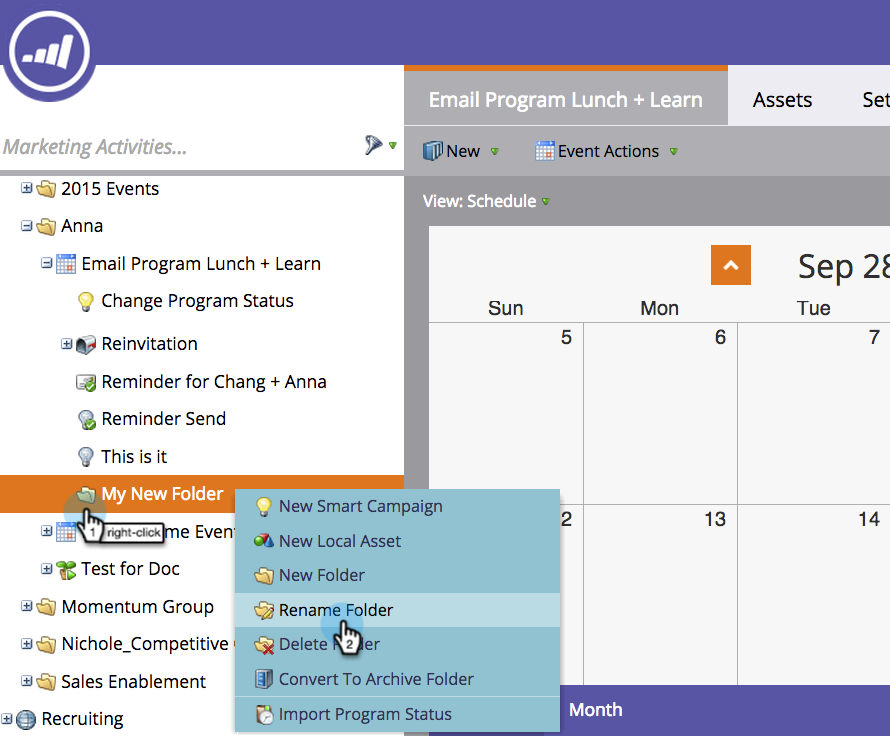

# Understanding Folders {#understanding-folders}

Understanding Folders - Marketo Docs - Product Documentation

Folders inside a program can be used to organize your smart campaigns and assets. These are different from [campaign folders](create-new-campaign-folder.md).

### What's in this article? {#what-s-in-this-article}

[Create a Folder](#understandingfolders-createafolder)  
[Rename a Folder](#understandingfolders-renameafolder)  
[Delete a Folder](#understandingfolders-deleteafolder)  
[Archive a Folder](#understandingfolders-archiveafolder)

#### Create a Folder {#understandingfolders-createafolder}

##### 1. Go to the Marketing Activities area. {#understandingfolders-gotothemarketingactivitiesarea.}

##### 2. Right-click a program and select New Folder. {#understandingfolders-right-clickaprogramandselectnewfolder.}

##### 3. Name the new folder and press Enter. {#understandingfolders-namethenewfolderandpressenter.}

Great! Now you have a new folder to store your local assets.

#### Rename a Folder {#understandingfolders-renameafolder}

It's okay to change your mind.

##### 1. Right-click the folder and select Rename Folder.  {#understandingfolders-right-clickthefolderandselectrenamefolder.}

##### 2. Type in a new name and press Enter. {#understandingfolders-typeinanewnameandpressenter.}

Et Volia! The folder has a new name.

#### Delete a Folder {#understandingfolders-deleteafolder}

>[!NOTE]
>
>Make sure the folder is empty before deleting it.

##### 1. Right-click the folder and select Delete Folder. {#understandingfolders-right-clickthefolderandselectdeletefolder.}

Adios folder!

#### Archive a Folder {#understandingfolders-archiveafolder}

In Marketo you have the ability to convert existing folders into Archive folders. Archive folders exist in Marketing Activities, Database, and Design Studio.

When you archive a folder:

* The folder and assets are no longer visible in search results. If you search for a Program or Event that’s inside an archived folder, the results return a collapsed view of the archived folder
* The assets in the folder no longer appear in auto suggest
* Archived templates are not available when creating an email or landing page in Design Studio
* Archived pages can’t be used in landing page test groups

Functionality that will **not** change when archiving:

* Global search still finds results in archived folders
* An asset that’s in use will continue to work even after it’s archived
* You can use a filter to select archived assets for use in reports
* Archived assets are not deactivated. They must also be deactivated if you want them to stop running

