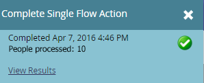

# Prepare for Your Event {#prepare-for-your-event}

Prepare for Your Event - Marketo Docs - Product Documentation

There are several things you have to do to get ready for the event.

>[!NOTE]
>
>**FYI**
>
>Marketo is now standardizing language across all subscriptions, so you may see lead/leads in your subscription and person/people in docs.marketo.com. These terms mean the same thing; it does not affect article instructions. There are some other changes, too. [Learn more](http://docs.marketo.com/display/DOCS/Updates+to+Marketo+Terminology).

### What's in this article? {#what-s-in-this-article}

[Create a New Marketo Role](#prepareforyourevent-createanewmarketorole)  
[Invite New Tablet Users to the Event](#prepareforyourevent-invitenewtabletuserstotheevent)  
[Create a New Marketo Event Program](#prepareforyourevent-createanewmarketoeventprogram)  
[Specify the Event Dates](#prepareforyourevent-specifytheeventdates)  
[Add People to Your Event](#prepareforyourevent-addpeopletoyourevent)

#### Create a New Marketo Role {#prepareforyourevent-createanewmarketorole}

`Marketo has a special user role for the event check-in app.` [Create a new Marketo role](https://docs.marketo.com/display/DOCS/Grant+User+Access+to+the+Check-in+App) for iPad or Android users, with permission to access the mobile application.

#### Invite New Tablet Users to the Event {#prepareforyourevent-invitenewtabletuserstotheevent}

[Invite new tablet users to the event](https://docs.marketo.com/display/DOCS/Grant+User+Access+to+the+Check-in+App) and assign them the new role.

#### Create a New Marketo Event Program {#prepareforyourevent-createanewmarketoeventprogram}

[Create a new Marketo event program](../../../../../welcome-to-marketo-docs/product-docs/demand-generation/events/understanding-events/create-a-new-event-program.md) to c `apture the status of your people as they progress through different stages and get accurate measures of the ROI for your marketing initiatives.`

#### Specify the Event Dates {#prepareforyourevent-specifytheeventdates}

It's a snap to set your event dates.

##### 1. Click the event on the schedule and set the start and end date and time. {#prepareforyourevent-clicktheeventonthescheduleandsetthestartandenddateandtime.}

##### 2. Slide over to change Tentative to Confirmed.  {#prepareforyourevent-slideovertochangetentativetoconfirmed.}

>[!CAUTION]
>
>If the date of the Event is more than one week before or after the current date, your event will not appear in the app. **Tip**: To test it, temporarily set the dates to within one week of today. Remember to return the event to the correct dates after you test it.

#### Add People to Your Event {#prepareforyourevent-addpeopletoyourevent}

Now that you know the *when*, it's time to add the *who*.

##### 1. If you already have a list of people, in My Marketo, click the Database tile. {#prepareforyourevent-ifyoualreadyhavealistofpeople-inmymarketo-clickthedatabasetile.}

##### 2. Select a list with people and click the People tab. {#prepareforyourevent-selectalistwithpeopleandclickthepeopletab.}

##### 3. Select the people for your event from the list. Use Ctrl (or Command on a Mac) to click on multiple people, or Select All to mark all of them. {#prepareforyourevent-selectthepeopleforyoureventfromthelist.usectrl(orcommandonamac)toclickonmultiplepeople-orselectalltomarkallofthem.}

##### 4. Click Person Actions, hover over Programs and select Change Program Status. {#prepareforyourevent-clickpersonactions-hoveroverprogramsandselectchangeprogramstatus.}

##### 5. Click the Program drop-down list and select your event. {#prepareforyourevent-clicktheprogramdrop-downlistandselectyourevent.}

##### 6. Click the New Status drop-down and select Roadshow > Registered. Click Run Now. {#prepareforyourevent-clickthenewstatusdrop-downandselectroadshow>registered.clickrunnow.}

##### 7. A small window displays progress...  {#prepareforyourevent-asmallwindowdisplaysprogress...}

##### 8. ...and indicates when the task is complete.  {#prepareforyourevent-...andindicateswhenthetaskiscomplete.}

The selected people are now in your event, ready to be checked in using the tablet app on the trade show floor.
