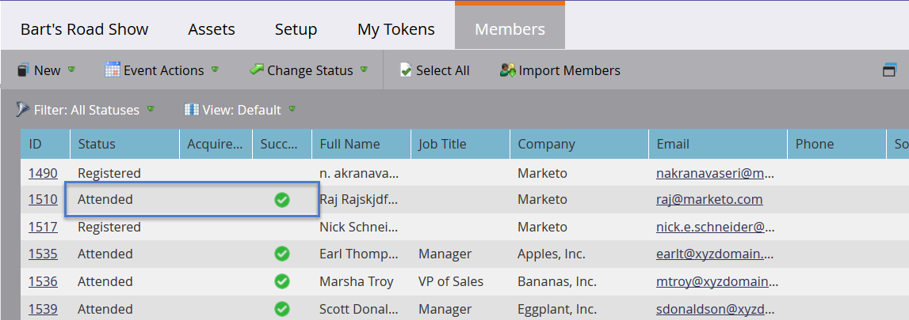

# Set Up the iPad or Android Tablet {#set-up-the-ipad-or-android-tablet}

Set Up the iPad or Android Tablet - Marketo Docs - Product Documentation

For a smooth experience on event day, prepare your iPad or Android tablet and test the Marketo Events app before the event.

After you've created the event in Marketo, it loads into the Marketo Events iPad or Android app when you log in, if:

* The account has access to your database
* The event is scheduled on a date in the time period that starts one week before and ends one week after the current date
* The event was created in the appropriate channel (for example, Roadshow)

### What's in this article? {#what-s-in-this-article}

[Download and Install the Marketo Events iPad App](#setuptheipadorandroidtablet-downloadandinstallthemarketoeventsipadapp)  
[Download and Install the Marketo Events Android App](#setuptheipadorandroidtablet-downloadandinstallthemarketoeventsandroidapp)  
[Confirm Login Credentials for iPad and Tablet Users](#setuptheipadorandroidtablet-confirmlogincredentialsforipadandtabletusers)  
[Sync the App to Populate the Event](#setuptheipadorandroidtablet-synctheapptopopulatetheevent)  
[Confirm Check-Ins are Working](#setuptheipadorandroidtablet-confirmcheck-insareworking)

>[!NOTE]
>
>You must be connected to the Internet to download apps.

#### Download and Install the Marketo Events iPad App {#setuptheipadorandroidtablet-downloadandinstallthemarketoeventsipadapp}

If your iPad doesn't already have the Marketo Events app installed, here's how to get it.

##### 1. Open your iPad and launch the App Store. {#setuptheipadorandroidtablet-openyouripadandlaunchtheappstore.}

##### 2. In the search box, enter Marketo and in Suggestions, tap marketo events. {#setuptheipadorandroidtablet-inthesearchbox-entermarketoandinsuggestions-tapmarketoevents.}

##### 3. Follow the procedures to download and install the app on your iPad. {#setuptheipadorandroidtablet-followtheprocedurestodownloadandinstalltheapponyouripad.}

#### Download and Install the Marketo Events Android App {#setuptheipadorandroidtablet-downloadandinstallthemarketoeventsandroidapp}

If your Android tablet doesn't have the Marketo Events app installed yet, here's how to get it.

##### 1. Open your tablet and tap the Google Play Store app. {#setuptheipadorandroidtablet-openyourtabletandtapthegoogleplaystoreapp.}

##### 2. In the Search box, enter Marketo and tap Return. {#setuptheipadorandroidtablet-inthesearchbox-entermarketoandtapreturn.}

##### 3. In the Search results, tap the Marketo Events app. {#setuptheipadorandroidtablet-inthesearchresults-tapthemarketoeventsapp.}

##### 4. Follow the procedures to download and install the app on your tablet. {#setuptheipadorandroidtablet-followtheprocedurestodownloadandinstalltheapponyourtablet.}

#### Confirm Login Credentials for iPad and Tablet Users {#setuptheipadorandroidtablet-confirmlogincredentialsforipadandtabletusers}

Before you assign iPads or tablets to trade show staff, confirm that the login credentials that they will be using work properly, and that your event appears on the app's Home screen.

##### 1. Follow the login procedures for iPad or tablet to sign in. {#setuptheipadorandroidtablet-followtheloginproceduresforipadortablettosignin.}

##### 2. Confirm that your event appears on the Home screen. Remember, it appears only if its dates are within one week before and one week after the current date. {#setuptheipadorandroidtablet-confirmthatyoureventappearsonthehomescreen.remember-itappearsonlyifitsdatesarewithinoneweekbeforeandoneweekafterthecurrentdate.}

>[!NOTE]
>
>It can take several minutes after creating a new event for it to appear in the iPad or tablet app. If it doesn't appear, tap **Logout** on the Home screen, wait a few minutes, then log in again.

#### Sync the App to Populate the Event {#setuptheipadorandroidtablet-synctheapptopopulatetheevent}

Sync to be sure the people you've added are there.

##### 1. Open your event in the iPad or Android app. {#setuptheipadorandroidtablet-openyoureventintheipadorandroidapp.}

##### 2. Look for the people. If you don't see them, tap Sync to sync the app and reload the Events people list. {#setuptheipadorandroidtablet-lookforthepeople.ifyoudon'tseethem-tapsynctosynctheappandreloadtheeventspeoplelist.}

**iPad**

**Android**

  

#### Confirm Check-Ins are Working {#setuptheipadorandroidtablet-confirmcheck-insareworking}

Be sure to confirm that check-ins are working from the iPad or tablet before the event.

##### 1. In the app, [check a test lead in](check-people-into-your-event-from-your-tablet.md). {#setuptheipadorandroidtablet-intheapp-checkatestleadin.}

##### 2. Tap the Sync icon to sync the app. {#setuptheipadorandroidtablet-tapthesyncicontosynctheapp.}

##### 3. In Marketo, open your event and click Members. {#setuptheipadorandroidtablet-inmarketo-openyoureventandclickmembers.}

##### 4. Confirm that the person's status is changed to Attended and Success is checked. {#setuptheipadorandroidtablet-confirmthattheperson'sstatusischangedtoattendedandsuccessischecked.}

>[!TIP]
>
>Use yourself as the test person.

