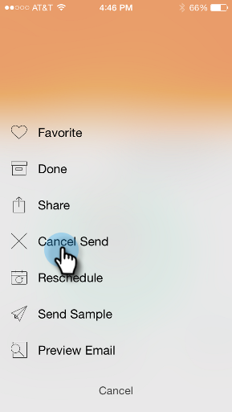
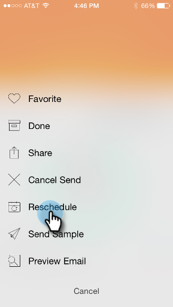

# Understanding Email Program Cards {#understanding-email-program-cards}

Understanding Email Program Cards - Marketo Docs - Product Documentation

Use Marketo Moments to view your Email Programs from your phone or iPad.

### What's in this article? {#what-s-in-this-article}

[Email Program Cards](#understandingemailprogramcards-emailprogramcards)  
[Confirming an Email Card](#understandingemailprogramcards-confirminganemailcard)  
[Canceling an Email Card Send](#understandingemailprogramcards-cancelinganemailcardsend)  
[Rescheduling an Email Card](#understandingemailprogramcards-reschedulinganemailcard)  
[Sending a Sample](#understandingemailprogramcards-sendingasample)  
[Previewing an Email](#understandingemailprogramcards-previewinganemail)

#### Email Program Cards {#understandingemailprogramcards-emailprogramcards}

`<iframe width="420" height="315" src="https://www.youtube-nocookie.com/embed/n8JTSZI22Do" frameborder="0" allowfullscreen></iframe>` When you tap any Email Program card you can:

* [Make an email a favorite](../../../../../../welcome-to-marketo-docs/product-docs/core-marketo-concepts/mobile-apps/marketo-moments/working-with-moments/creating-a-favorite.md)
* [Mark an email as done](../../../../../../welcome-to-marketo-docs/product-docs/core-marketo-concepts/mobile-apps/marketo-moments/working-with-moments/marking-it-done.md)
* [Share an email moment card](../../../../../../welcome-to-marketo-docs/product-docs/core-marketo-concepts/mobile-apps/marketo-moments/working-with-moments/sharing-a-moment.md)

On an email program card for an email that's not sent yet, you'll find information about that email program's status and audience.

After the email has been sent, the card displays other valuable information, including the number of delivered emails, the recipients' actions, and a link to the smart list used in the campaign.

#### Confirming an Email Card {#understandingemailprogramcards-confirminganemailcard}

##### 1. To confirm an unconfirmed email card, tap the three dot menu.  {#understandingemailprogramcards-toconfirmanunconfirmedemailcard-tapthethreedotmenu.}

##### 2. Tap Confirm.  {#understandingemailprogramcards-tapconfirm.}

##### 3. Tap Confirm to finish the job, or Never Mind if you had second thoughts. {#understandingemailprogramcards-tapconfirmtofinishthejob-ornevermindifyouhadsecondthoughts.}

>[!NOTE]
>
>Now your card will turn to orange!

#### Canceling an Email Card Send {#understandingemailprogramcards-cancelinganemailcardsend}

##### 1. If you decide not to send your confirmed email out, tap the three dot menu.  {#understandingemailprogramcards-ifyoudecidenottosendyourconfirmedemailout-tapthethreedotmenu.}

##### 2. Tap Cancel Send.  {#understandingemailprogramcards-tapcancelsend.}

#### Rescheduling an Email Card {#understandingemailprogramcards-reschedulinganemailcard}

You can reschedule confirmed or unconfirmed email cards.

>[!NOTE]
>
>For emails that are already confirmed, you have to cancel the email first (see below).

##### 1. To reschedule an email, tap the three dot menu. {#understandingemailprogramcards-torescheduleanemail-tapthethreedotmenu.}

##### 2. Tap Reschedule. {#understandingemailprogramcards-tapreschedule.}

##### 3. Select a date on the calendar and tap Reschedule. {#understandingemailprogramcards-selectadateonthecalendarandtapreschedule.}

As long as you've got wireless service, you can reschedule from anywhere!

#### Sending a Sample {#understandingemailprogramcards-sendingasample}

You can share a sample of an email moment directly with someone.

##### 1. Open the Card Menu.  {#understandingemailprogramcards-openthecardmenu.}

##### 2. Tap Send Sample.  {#understandingemailprogramcards-tapsendsample.}

##### 3. Enter an email address and click Send Sample. {#understandingemailprogramcards-enteranemailaddressandclicksendsample.}

#### Previewing an Email {#understandingemailprogramcards-previewinganemail}

Right click on an email card to preview it.

##### 1. Tap Preview Email. {#understandingemailprogramcards-tappreviewemail.}

This way, you know your email's perfect before you pull the trigger!   

Excellent!

And that's the scoop on viewing your email campaigns. Now, you're a pro!

>[!NOTE]
>
>**Related Articles**
>
>* [Understanding Marketo Moments](understanding-marketo-moments.md)
>* [Understanding Event Cards](understanding-event-cards.md)
>* [Understanding Analytics Cards](understanding-analytics-cards.md)
>* [Email Programs](../../../../../../welcome-to-marketo-docs/product-docs/email-marketing/email-programs.md)
>

