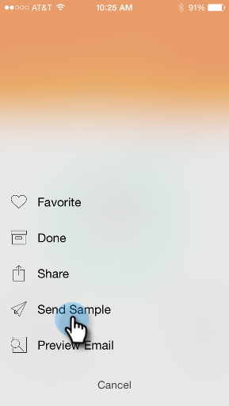

# Sending a Sample {#sending-a-sample}

Sending a Sample - Marketo Docs - Product Documentation

You can share a sample of an email moment directly with someone. There are two ways to do it.

#### The Regular Way {#sendingasample-theregularway}

##### 1. Open the Card Menu.  {#sendingasample-openthecardmenu.}

##### 2. Tap Send Sample.  {#sendingasample-tapsendsample.}

##### 3. Enter an email address and click Send Sample. {#sendingasample-enteranemailaddressandclicksendsample.}

#### The Quick Way {#sendingasample-thequickway}

##### 1. Tap the paper airplane icon on the Email Preview screen to send a sample directly from the preview.   

{#sendingasample-tapthepaperairplaneiconontheemailpreviewscreentosendasampledirectlyfromthepreview.}

Mission Accomplished!
