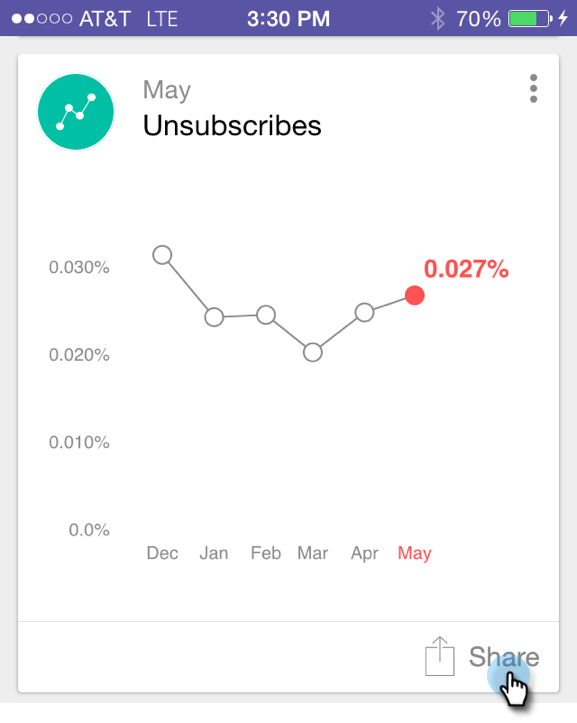
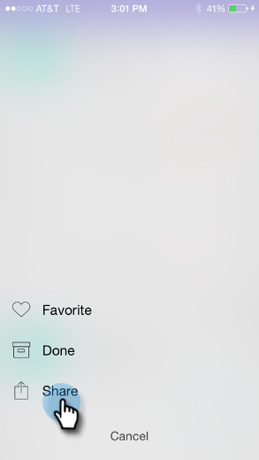

# Sharing a Moment {#sharing-a-moment}

Sharing a Moment - Marketo Docs - Product Documentation

Want to give an update to your team? You've got two choices to select sharing:

##### 1. Tap the Share icon on the card. {#sharingamoment-taptheshareicononthecard.}

##### 2. Tap the card menu and tap Share on the Details screen.  {#sharingamoment-tapthecardmenuandtapshareonthedetailsscreen.}

##### 3. Select the way you want to share. Let's go with email. {#sharingamoment-selectthewayyouwanttoshare.let'sgowithemail.}

>[!NOTE]
>
>Sharing depends on the apps installed on your phone. So, if you don't have Facebook, you won't see it in Moments.

3. Enter your recipient's address, a subject, and tap **Send**.

Great job!
