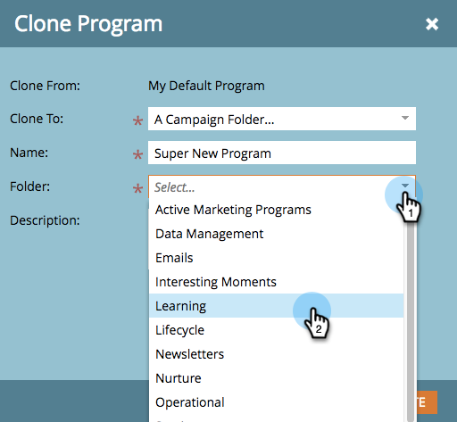

# Clone a Program {#clone-a-program}

Clone a Program - Marketo Docs - Product Documentation

You can quickly and easily clone an entire program and all its assets instead of manually rebuilding everything. Here's how.

1. Find and select the program you want to clone, then under **Program Actions** click **Clone.**

   

1. Select where you want to clone your program to.

   >[!NOTE]
   >
   >Programs can be cloned into [campaign](../../../../../welcome-to-marketo-docs/product-docs/core-marketo-concepts/miscellaneous/create-new-campaign-folder.md) [folders](../../../../../welcome-to-marketo-docs/product-docs/core-marketo-concepts/miscellaneous/create-new-campaign-folder.md) or [workspaces](../../../../../welcome-to-marketo-docs/product-docs/administration/workspaces-and-person-partitions/create-a-new-workspace.md). Make sure you share all underlying dependent assets (emails, snippets, landing page templates, etc.) with the destination workspace before cloning.

   

   >[!NOTE]
   >
   >**Explanation**
   >
   >
   >See that NOTE in the screenshot above? It means if you clone a program with 1000 or more people in a list, the list itself will get cloned, but it will be empty. If you clone a program with a list that contains 999 people or less, that list, along with all of its members, will show up in the cloned program.

   ##### Enter a Name. {#cloneaprogram-enteraname.}

   

   ##### Choose the folder you'd like to clone your program to.  {#cloneaprogram-choosethefolderyou'dliketocloneyourprogramto.}

   

   ##### Add an optional description, then click Create. Look how quickly you were able to create a new program with all its assets ready to go! {#cloneaprogram-addanoptionaldescription-thenclickcreate.lookhowquicklyyouwereabletocreateanewprogramwithallitsassetsreadytogo!}

   

   >[!TIP]
   >
   >Use this technique along with [tokens](../../../../../welcome-to-marketo-docs/product-docs/email-marketing/general/using-tokens.md) to make new program creation a snap.

   >[!CAUTION]
   >
   >Period costs will not transfer over, so be sure to add that to your cloned program if you had one set in the original.

