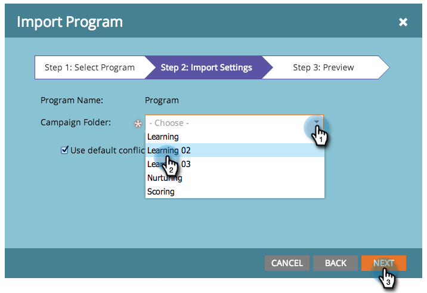

# Import a Program {#import-a-program}

Import a Program - Marketo Docs - Product Documentation

A program can be imported from one Marketo subscription to another. For instance, you can create a program in a sandbox and then import it into your live subscription. Also, you can import a pre-built program from the Marketo Program Library.

>[!NOTE]
>
>**FYI**
>
>Marketo is now standardizing language across all subscriptions, so you may see lead/leads in your subscription and person/people in docs.marketo.com. These terms mean the same thing; it does not affect article instructions. There are some other changes, too. [Learn more](http://docs.marketo.com/display/DOCS/Updates+to+Marketo+Terminology).

### What's in this article? {#what-s-in-this-article}

[Import a Program](#importaprogram-importaprogram)  
[Identify Pre-Built Programs in the Marketo Program Library](#importaprogram-identifypre-builtprogramsinthemarketoprogramlibrary)  
[Impact on External Assets During Program Imports](#importaprogram-impactonexternalassetsduringprogramimports)  
[Watch a Video](#importaprogram-watchavideo)

#### Import a Program {#importaprogram-importaprogram}

1. Go to **Marketing Activities.**

   

1. Click **New **drop down. Select **Import Program**.

   

   >[!NOTE]
   >
   >Program Import is only available for users that have roles with Import Program permission enabled. Learn more about [managing user roles and permissions](../../../../../welcome-to-marketo-docs/product-docs/administration/users-and-roles/managing-user-roles-and-permissions.md).
   >
   >
   >To connect a sandbox account to your live subscription, contact [Marketo Support](http://www.marketo.com/services/support/).

1. Select a Marketo **Subscription** and a program to import. Click **Next**.

   

1. Specify a **Campaign Folder** for the imported program. Click **Next.**

   

   >[!NOTE]
   >
   >`Make sure** **`**Use default conflict** `rules is selected. Conflict rules are needed when you import programs into an instance that have assets of the same name.`

1. Preview details and **Import** the program.

   

   A dialog displays the program import progress.

   

You will receive an email confirmation once the import has finished.

>[!NOTE]
>
>You'll need to reschedule imported batch campaigns and activate trigger campaigns. The system automatically deactivates campaign schedules and trigger campaigns in the imported program.

#### Identify Pre-Built Programs in the Marketo Program Library {#importaprogram-identifypre-builtprogramsinthemarketoprogramlibrary}

The Marketo Program Library contains pre-built, tested programs that you can import into your subscription. Available programs include:

1. **Basic Drip Nurture.** Sends a series of emails separated by wait steps.
1. **Data Management.** Maintains data integrity using smart campaigns.
1. **Email with Landing Page.** Sends an initial email with an offer, such as “download this white paper." Follows up with a confirmation or reminder email. Includes a landing page with a form.
1. **Email with Progression Statuses.** Sends out a mail blast with a trackable link for the person to click. Updates the progression status for each person – Sent, Opened, Clicked etc.
1. **Interesting Moments.** Creates interesting moments for your sales team to keep them in the loop.
1. **Landing Page with Autoresponder.** Use downloadable content to get new people and nurture them. Includes landing pages and forms.
1. **Lifecycle 2.** Uses scoring to move a person from new to marketing qualified.
1. **Mobile Email Template.** A responsive email template tested against iPhone and Android. Certain versions of Android, MS Outlook, Exchange, and third-party apps like the Gmail and Yahoo! Mail mobile apps do not support the CSS required for responsive templates. We recommend that you test before sending out emails.
1. **Program Import Sweepstakes.** Sweepstakes program for those trying the Program Library! Just approve the emails and landing page and activate the smart campaign. Then view the approved landing page, fill out the form, and you're entered!
1. **Sales Available Campaigns.** Gives your sales reps a way to execute Marketo smart campaigns from a Dashboard in your CRM.
1. **Scoring - Spark Edition.** Demographic and behavioral scoring captured in a single scoring field. Includes more than two dozen scoring-related campaigns.
1. **Scoring - Standard & Select Editions.** Demographic and behavioral scoring captured in separate scoring fields. Includes more than two dozen scoring-related campaigns.
1. **Sync New People to CRM.** The campaign which syncs new people to your CRM system. It assigns a person status such that it is recognized as not being sales-ready.
1. **Webinar with Event Adapter.** A full set of emails – such as invites and reminders – plus landing pages with forms and campaigns for moving people through the program. This program gets updates about registration, attendance, etc. from online events providers such as WebEx.
1. **Webinar without Event Adapter.** Same as above, but with manual processes for recording registration, attendance, etc.
1. **Sirius Decisions Scoring Program**. This program is built to support the standard Sirius Decisions Scoring Model, including the implicit and explicit scoring rules and matrixed person assignment. View [this PDF](http://docs.marketo.com/display/docs/assets/sirius-decisions-scoring-program-overview.pdf)for details.

>[!CAUTION]
>
>You must create two custom fields (“Demographic Score” and “Behavior Score”) before importing the Scoring - Standard & Select Editions program.

#### Impact on External Assets During Program Imports {#importaprogram-impactonexternalassetsduringprogramimports}

Programs use external assets like email templates, landing page templates, images, forms, tokens, and program tags. You have the ability to configure how landing page templates and program tags are handled, and Marketo automatically manages the rest.

**Email Templates: **Email templates are automatically imported and created unless one with the same name exists.

**Landing Page Templates: **Landing page templates are imported into the design studio. You can use conflict rules to configure behavior when a template with the same name exists. Using the default rule, a number will be appended to a landing page template if one with the same name exists. For example, a landing page template named Standard Template 1 will be created if one named Standard Template exists.

**Images: **Images used by landing pages are imported into the design studio unless one with the same name exists.

**Tokens: **Tokens that live outside of a program will be converted to local tokens during the import process.

>[!CAUTION]
>
>Image type my tokens are not supported for program imports. If a program that has image type my tokens is imported, **no **tokens will come through.

**Program Tags: **You can use conflict rules to control how program tags that do not exist in the destination account will be treated. Using the default rule will create the program tags, or you can choose to ignore the tags.  **Forms: **External forms will automatically be imported into the design studio unless one with the same name exists.

>[!CAUTION]
>
>When importing a program, landing pages/emails that contain [dynamic content](http://docs.marketo.com/x/yRAt) will be skipped.

#### Watch a Video {#importaprogram-watchavideo}

`<iframe width="630" height="470" src="//play.vidyard.com/KgvZssZ9WRkZgDsY1yZfms.html?v=3.1.1" frameborder="0" allowfullscreen></iframe>`  