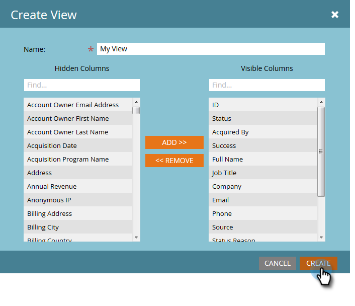

# Manage and View Members {#manage-and-view-members}

Manage and View Members - Marketo Docs - Product Documentation

You can manage and view your members in your programs using the Members tab.

>[!NOTE]
>
>**FYI**
>
>Marketo is now standardizing language across all subscriptions, so you may see lead/leads in your subscription and person/people in docs.marketo.com. These terms mean the same thing; it does not affect article instructions. There are some other changes, too. [Learn more](http://docs.marketo.com/display/DOCS/Updates+to+Marketo+Terminology).

>[!NOTE]
>
>**Deep Dive**
>
>`Dive deeper into` [program membership](../../../../../welcome-to-marketo-docs/product-docs/core-marketo-concepts/programs/creating-programs/understanding-program-membership.md).

### What's in this article? {#what-s-in-this-article}

[Search for a Member](#manageandviewmembers-searchforamember)  
[Export the Members Grid](#manageandviewmembers-exportthemembersgrid)  
[Manage Columns in the Members Grid](#manageandviewmembers-managecolumnsinthemembersgrid)  
[Choose Which Columns are Visible in the Grid](#manageandviewmembers-choosewhichcolumnsarevisibleinthegrid)  
[Filter the Members Grid](#manageandviewmembers-filterthemembersgrid)  
[Manage Person Status in the Members Grid](#manageandviewmembers-managepersonstatusinthemembersgrid)

#### Search for a Member {#manageandviewmembers-searchforamember}

At the bottom of the Members section, use the search field to search for program members by name, email, job title, or company.

##### 1. Click the Members tab of your program. {#manageandviewmembers-clickthememberstabofyourprogram.}

1. Use the search field to search the list of members.

   

#### Export the Members Grid {#manageandviewmembers-exportthemembersgrid}

You can export your member list by clicking the Excel icon next to the search field.

#### Manage Columns in the Members Grid {#manageandviewmembers-managecolumnsinthemembersgrid}

##### Drag and drop columns to change their order. The pair of blue arrows indicate where the column will go.  {#manageandviewmembers-draganddropcolumnstochangetheirorder.thepairofbluearrowsindicatewherethecolumnwillgo.}

##### Right-click the column header to sort alphabetically, either ascending or descending.  {#manageandviewmembers-right-clickthecolumnheadertosortalphabetically-eitherascendingordescending.}

#### Choose Which Columns are Visible in the Grid {#manageandviewmembers-choosewhichcolumnsarevisibleinthegrid}

1. Click the **View **drop-down and select **Create View**.

   

1. Name your custom view. Select column titles. Click** Add **and** Remove **to move columns and create a view.

   

1. Click **Create**.

   

#### Filter the Members Grid  {#manageandviewmembers-filterthemembersgrid}

1. Click the **Filter** drop-down and select a progression step to sort by.

   

#### Manage Person Status in the Members Grid {#manageandviewmembers-managepersonstatusinthemembersgrid}

You can change the status of your people inside the members grid.

##### 1. Hold down Ctrl/Cmd and select the people.  {#manageandviewmembers-holddownctrl/cmdandselectthepeople.}

1. Click the **Change Status** drop-down and select a status.

   

   This may take a moment. You'll see the message below when it's all done! 

   

So many features, but they're all pretty straightforward. Enjoy!

>[!NOTE]
>
>**Related Articles**
>
>* [Create a Program Performance Report](../../../../../welcome-to-marketo-docs/product-docs/core-marketo-concepts/programs/program-performance-report/create-a-program-performance-report.md)
>

