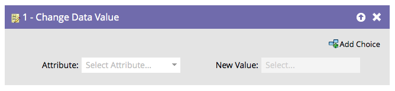

# Change Data Value {#change-data-value}

Change Data Value - Marketo Docs - Product Documentation

#### Overview {#changedatavalue-overview}

You can use Marketo to update the value of a field. For this, you will use the **Change Data Value **flow action.

>[!NOTE]
>
>`You can also block a field from being updated. See` [Block Updates to a Field](../../../../../welcome-to-marketo-docs/product-docs/administration/field-management/block-updates-to-a-field.md) `for details.`

#### Usage {#changedatavalue-usage}

1. Find and select the field you want to change the value of.

   

1. Enter the value you want, and you're done!

   

   >[!NOTE]
   >
   >**Reminder**
   >
   >
   >`You can also use tokens in`**New Value** `.`

   >[!TIP]
   >
   >`You can enter 'NULL' (no quotes, all caps) in` **New Value** `to clear the field. See` [Clear Field Values](change-data-value/clear-field-values.md) `for details.`

   >[!NOTE]
   >
   >**Related Articles**
   >
   >    
   >    
   >    * [Tokens for Flow Steps](use-tokens-in-flow-steps.md)
   >    * [Append Data to a Field](append-data-to-a-field.md)
   >    
   >

