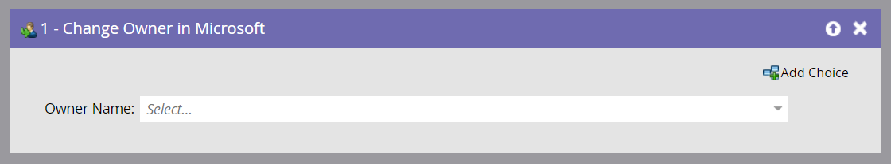

# Change Owner in Microsoft {#change-owner-in-microsoft}

Change Owner in Microsoft - Marketo Docs - Product Documentation

If you have existing people that are already assigned to an owner, you can use this flow step to re-assign them to another owner.

>[!NOTE]
>
>This flow step will **only work when used with triggers**, not filters, in your smart campaign.

**Usage**

1. Simply pick the owner you want to change to and go!

   

   >[!NOTE]
   >
   >If the record does not yet exist in your Dynamics account, we will sync it over, then assign it to the selected user.

