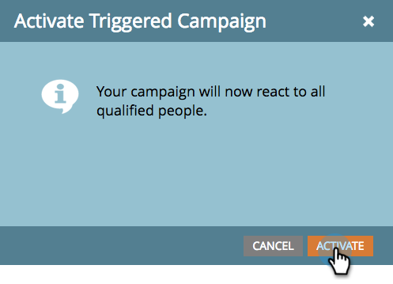

# Activate a Trigger Smart Campaign | Schedule Tab {#activate-a-trigger-smart-campaign-schedule-tab}

Activate a Trigger Smart Campaign | Schedule Tab - Marketo Docs - Product Documentation

Activating a trigger smart campaign is like turning it ON. Here's what to do.

1. In the smart campaign's `**Schedule**`tab, click **Activate**.

   

   >[!TIP]
   >
   >Review the smart campaign before activating.

1. `Click`**Activate** ` again.  
   `

   

   >[!CAUTION]
   >
   >Be sure the campaign is ready before you click Activate!

From this moment forward, anyone who qualifies for the smart list will go through the flow defined by your smart campaign. 