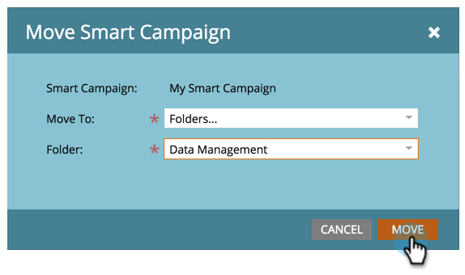

# Move a Smart Campaign {#move-a-smart-campaign}

Move a Smart Campaign - Marketo Docs - Product Documentation

Move a smart campaign between different programs or folders by using drag-and-drop or the move feature in the tree.

### What's in this article? {#what-s-in-this-article}

[Use Drag-and-Drop](#moveasmartcampaign-usedrag-and-drop)  
[Use the Move Feature](#moveasmartcampaign-usethemovefeature)

#### Use Drag-and-Drop {#moveasmartcampaign-usedrag-and-drop}

##### 1. Go to Marketing Activities. {#moveasmartcampaign-gotomarketingactivities.}

##### 2. Select the smart campaign and drag and drop it into a new program. {#moveasmartcampaign-selectthesmartcampaignanddraganddropitintoanewprogram.}

Awesome! That smart campaign is now in a new program. This works with folders as well.

>[!NOTE]
>
>The rules of your smart campaign will not change - it will just be nested in a different place.

#### Use the Move Feature {#moveasmartcampaign-usethemovefeature}

Smart campaigns can also be moved using the move feature in the tree.

##### 1. Right-click the smart campaign. Select Move. {#moveasmartcampaign-right-clickthesmartcampaign.selectmove.}

##### 2. Choose between moving to a Program or a Folder. {#moveasmartcampaign-choosebetweenmovingtoaprogramorafolder.}

##### 3. Select the specific place for the smart campaign to move. {#moveasmartcampaign-selectthespecificplaceforthesmartcampaigntomove.}

##### 4. Click Move. {#moveasmartcampaign-clickmove.}

High five! This smart campaign has been moved.

