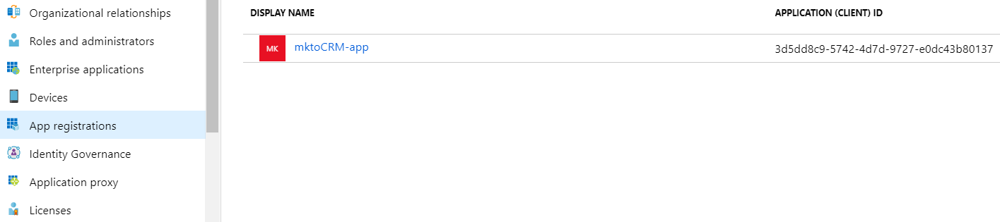

# Register an App with Azure to Acquire Your Client ID/App ID {#register-an-app-with-azure-to-acquire-your-client-id-app-id}

Register an App with Azure to Acquire Your Client ID/App ID - Marketo Docs - Product Documentation

`Azure Active Directory extends your on-premises directories into the cloud, providing support for MS Dynamics 365 CRM with on-premise ADFS authentication.`

### What's in this article? {#what-s-in-this-article}

[Registering a New App](#registeranappwithazuretoacquireyourclientid/appid-registeringanewapp)  
[Configuring App Permissions](#registeranappwithazuretoacquireyourclientid/appid-configuringapppermissions)

#### Registering a New App {#registeranappwithazuretoacquireyourclientid/appid-registeringanewapp}

##### 1. [Log-in](http://manage.windowsazure.com/) to the Microsoft Azure management portal using an account with admin permissions. You can also access the Microsoft Azure portal through the Office 365 Admin Center by expanding the Admin item in the left navigation pane and selecting Azure AD. {#registeranappwithazuretoacquireyourclientid/appid-log-intothemicrosoftazuremanagementportalusinganaccountwithadminpermissions.youcanalsoaccessthemicrosoftazureportalthroughtheoffice365admincenterbyexpandingtheadminitemintheleftnavigationpaneandselectingaz}

>[!CAUTION]
>
>You must use an account in the same Office 365 subscription as the one you intend to register the app with.

>[!NOTE]
>
>If you don’t have an Azure account, you can [sign up](https://azure.microsoft.com/en-us/free/) for one. Please refer to Microsoft's documentation or reach out to your Microsoft representative for more information. Once you've created an Azure account, you can register one or more apps using the procedure outlined below.
>
>`If you have an Azure account but your Office 365 subscription with Microsoft Dynamics 365 isn't available in your Azure subscription, follow` [these instructions](https://msdn.microsoft.com/office/office365/howto/setup-development-environment#bk_CreateAzureSubscription) `to associate the two accounts.`

##### 2. Find and click Azure Active Directory in the left navigation pane. {#registeranappwithazuretoacquireyourclientid/appid-findandclickazureactivedirectoryintheleftnavigationpane.}

##### 3. Under Manage, click App registrations. {#registeranappwithazuretoacquireyourclientid/appid-undermanage-clickappregistrations.}

##### 4. Click New registration at the top of the page. {#registeranappwithazuretoacquireyourclientid/appid-clicknewregistrationatthetopofthepage.}

##### 5. Enter a name for your app, choose your applicable account type, and enter a Redirect URL. Then click Register at the bottom of the page. {#registeranappwithazuretoacquireyourclientid/appid-enteranameforyourapp-chooseyourapplicableaccounttype-andenteraredirecturl.thenclickregisteratthebottomofthepage.}

##### 6. You should now see your app in the App registrations tab. {#registeranappwithazuretoacquireyourclientid/appid-youshouldnowseeyourappintheappregistrationstab.}

#### Configuring App Permissions {#registeranappwithazuretoacquireyourclientid/appid-configuringapppermissions}

##### 1. Under the App registrations tab in your Active Directory, click the app you want to configure permissions for. {#registeranappwithazuretoacquireyourclientid/appid-undertheappregistrationstabinyouractivedirectory-clicktheappyouwanttoconfigurepermissionsfor.}

##### 2. Under Manage, click API permissions. {#registeranappwithazuretoacquireyourclientid/appid-undermanage-clickapipermissions.}

##### 3. Click the Add a permission button. {#registeranappwithazuretoacquireyourclientid/appid-clicktheaddapermissionbutton.}

##### 4. Choose Dynamics CRM. {#registeranappwithazuretoacquireyourclientid/appid-choosedynamicscrm.}

##### 5. Check the Access Common Data Service as organization users box, then click Add permissions.  
{#registeranappwithazuretoacquireyourclientid/appid-checktheaccesscommondataserviceasorganizationusersbox-thenclickaddpermissions.}

##### 6. Once the permissions have been successfully added, wait at least 10 seconds. {#registeranappwithazuretoacquireyourclientid/appid-oncethepermissionshavebeensuccessfullyadded-waitatleast10seconds.}

##### 7. Click the Grant admin consent button. {#registeranappwithazuretoacquireyourclientid/appid-clickthegrantadminconsentbutton.}

##### 8. Click Yes to confirm. {#registeranappwithazuretoacquireyourclientid/appid-clickyestoconfirm.}

And you're done!

