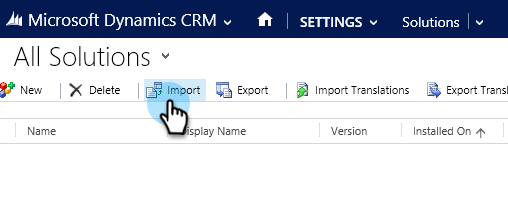

# Step 1 of 3: Install the Marketo Solution - 2015 On-Premises / 2016 Dynamics 365 On-Premises {#step-of-install-the-marketo-solution-on-premises-dynamics-on-premises}

Step 1 of 3: Install the Marketo Solution - 2015 On-Premises / 2016 Dynamics 365 On-Premises - Marketo Docs - Product Documentation

Before you can sync Microsoft Dynamics 2015 On-Premises or 2016 (Dynamics 365) with Marketo, you need to first install the Marketo solution in Dynamics.

>[!NOTE]
>
>After you sync Marketo to a CRM, you cannot sync a new CRM to the existing Marketo instance.

>[!NOTE]
>
>**Prerequisites**
>
>If you're using Microsoft Dynamics On-Premise, you must have [Internet Facing Deployment](http://www.microsoft.com/en-us/download/confirmation.aspx?id=41701) (IFD) with [Active Directory Federation Services](https://msdn.microsoft.com/en-us/library/bb897402.aspx) 2.0+ (ADFS) configured. Note: The IFD document downloads automatically when you click the link.
>
>[Download the Marketo Lead Management Solution](../../../../../../../../welcome-to-marketo-docs/product-docs/crm-sync/microsoft-dynamics-sync/sync-setup/download-the-marketo-lead-management-solution.md) before you start.

>[!NOTE]
>
>**Dynamics Admin Permissions required.**
>
>You need CRM administrator privileges to perform this sync.

##### 1. Login to Dynamics. Click the Microsoft Dynamics CRM drop-down menu and select  Settings. {#step1of3-installthemarketosolution-2015on-premises/2016dynamics365on-premises-logintodynamics.clickthemicrosoftdynamicscrmdrop-downmenuandselectsettings.}

##### 2. Under Settings, select Solutions. {#step1of3-installthemarketosolution-2015on-premises/2016dynamics365on-premises-undersettings-selectsolutions.}

##### 3. Click Import. {#step1of3-installthemarketosolution-2015on-premises/2016dynamics365on-premises-clickimport.}

##### 4. Click Browse and select the solution you [downloaded](../../../../../../../../welcome-to-marketo-docs/product-docs/crm-sync/microsoft-dynamics-sync/sync-setup/download-the-marketo-lead-management-solution.md). Click Next. {#step1of3-installthemarketosolution-2015on-premises/2016dynamics365on-premises-clickbrowseandselectthesolutionyoudownloaded.clicknext.}

##### 5. View the Solution Information and click View solution package details. {#step1of3-installthemarketosolution-2015on-premises/2016dynamics365on-premises-viewthesolutioninformationandclickviewsolutionpackagedetails.}

##### 6. When you're done checking all the details, click Close. {#step1of3-installthemarketosolution-2015on-premises/2016dynamics365on-premises-whenyou'redonecheckingallthedetails-clickclose.}

##### 7. Back on the Solution Information page, click Next. {#step1of3-installthemarketosolution-2015on-premises/2016dynamics365on-premises-backonthesolutioninformationpage-clicknext.}

##### 8. Make sure the SDK option checkbox is selected. Click Import. {#step1of3-installthemarketosolution-2015on-premises/2016dynamics365on-premises-makesurethesdkoptioncheckboxisselected.clickimport.}

##### 9. Wait for the import to finish. {#step1of3-installthemarketosolution-2015on-premises/2016dynamics365on-premises-waitfortheimporttofinish.}

>[!TIP]
>
>You will need to enable pop-ups on your browser to complete the installation process.

  

##### 10. Download a log file (if you want) and click Close. {#step1of3-installthemarketosolution-2015on-premises/2016dynamics365on-premises-downloadalogfile(ifyouwant)andclickclose.}

>[!NOTE]
>
>You may see a message saying "Marketo Lead Management completed with warning". This is fully expected.

  

##### 11. Marketo Lead Management will now appear on the All Solutions page. {#step1of3-installthemarketosolution-2015on-premises/2016dynamics365on-premises-marketoleadmanagementwillnowappearontheallsolutionspage.}

##### 12. Select the Marketo solution and click Publish All Customizations. {#step1of3-installthemarketosolution-2015on-premises/2016dynamics365on-premises-selectthemarketosolutionandclickpublishallcustomizations.}

High five! The installation is finished.

>[!CAUTION]
>
>Disabling any of the Marketo SDK Messaging Processes will result in a broken install!

>[!NOTE]
>
>**Related Articles**
>
>[Step 2 of 3: Set Up Marketo Sync User in Dynamics 2015 On-Premises / 2016 Dynamics 365 On-Premises](../../../../../../../../welcome-to-marketo-docs/product-docs/crm-sync/microsoft-dynamics-sync/sync-setup/microsoft-dynamics-2015-on-premises/2016-dynamics-365-on-premises/step-2-of-3-set-up-marketo-sync-user-in-dynamics-2015-on-premises-/-2016-dynamics-365-on-premises.md)

