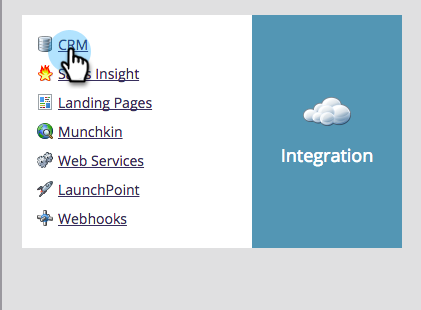

# Step 3 of 3: Connect Marketo and Dynamics 2015 On-Premises / 2016 Dynamics 365 On-Premises {#step-of-connect-marketo-and-dynamics-on-premises-dynamics-on-premises}

Step 3 of 3: Connect Marketo and Dynamics 2015 On-Premises / 2016 Dynamics 365 On-Premises - Marketo Docs - Product Documentation

>[!NOTE]
>
>**Prerequisites**
>
>* [Step 1 of 3: Install the Marketo Solution - 2015 On-Premises / 2016 Dynamics 365 On-Premises](../../../../../../../../welcome-to-marketo-docs/product-docs/crm-sync/microsoft-dynamics-sync/sync-setup/microsoft-dynamics-2015-on-premises/2016-dynamics-365-on-premises/step-1-of-3-install-the-marketo-solution-2015-on-premises-/-2016-dynamics-365-on-premises.md)
>* [Step 2 of 3: Set Up Marketo Sync User in Dynamics 2015 On-Premises / 2016 Dynamics 365 On-Premises](../../../../../../../../welcome-to-marketo-docs/product-docs/crm-sync/microsoft-dynamics-sync/sync-setup/microsoft-dynamics-2015-on-premises/2016-dynamics-365-on-premises/step-2-of-3-set-up-marketo-sync-user-in-dynamics-2015-on-premises-/-2016-dynamics-365-on-premises.md)
>

>[!NOTE]
>
>**Admin Permissions Required**

### What's in this article? {#what-s-in-this-article}

[Enter Dynamics Sync User information](#step3of3-connectmarketoanddynamics2015on-premises/2016dynamics365on-premises-enterdynamicssyncuserinformation)  
[Select Fields to Sync](#step3of3-connectmarketoanddynamics2015on-premises/2016dynamics365on-premises-selectfieldstosync)  
[Sync Fields for a Custom Filter](#step3of3-connectmarketoanddynamics2015on-premises/2016dynamics365on-premises-syncfieldsforacustomfilter)  
[Enable Sync](#step3of3-connectmarketoanddynamics2015on-premises/2016dynamics365on-premises-enablesync)

#### Enter Dynamics Sync User information {#step3of3-connectmarketoanddynamics2015on-premises/2016dynamics365on-premises-enterdynamicssyncuserinformation}

##### 1. Log into Marketo and click Admin. {#step3of3-connectmarketoanddynamics2015on-premises/2016dynamics365on-premises-logintomarketoandclickadmin.}

##### 2. Click CRM. {#step3of3-connectmarketoanddynamics2015on-premises/2016dynamics365on-premises-clickcrm.}

##### 3. Select Microsoft. {#step3of3-connectmarketoanddynamics2015on-premises/2016dynamics365on-premises-selectmicrosoft.}

##### 4. Click Edit in Step 1: Enter Credentials. {#step3of3-connectmarketoanddynamics2015on-premises/2016dynamics365on-premises-clickeditinstep1-entercredentials.}

>[!CAUTION]
>
>Please make sure your credentials are correct as we are unable to revert the subsequent schema changes after submission. If incorrect credentials are saved, you’ll have to obtain a new Marketo subscription.

##### 5. Enter the Username, Password a Microsoft Dynamics URL, and an *optional* Client Id. Click Save when done. {#step3of3-connectmarketoanddynamics2015on-premises/2016dynamics365on-premises-entertheusername-passwordamicrosoftdynamicsurl-andanoptionalclientid.clicksavewhendone.}

>[!NOTE]
>
>The Username in Marketo must match the User Name for the sync user in CRM. The format can be [ `[email protected]`](http://docs.marketo.com/cdn-cgi/l/email-protection#3c494f594e7c5853515d5552125f5351) or DOMAIN\user.

>[!TIP]
>
>Don't know the URL? We will show you how to find your [Dynamics Organization Service URL](../../../../../../../../welcome-to-marketo-docs/product-docs/crm-sync/microsoft-dynamics-sync/sync-setup/view-the-organization-service-url.md) here.

#### Select Fields to Sync {#step3of3-connectmarketoanddynamics2015on-premises/2016dynamics365on-premises-selectfieldstosync}

##### 1. Click Edit in Step 2: Select Fields to Sync. {#step3of3-connectmarketoanddynamics2015on-premises/2016dynamics365on-premises-clickeditinstep2-selectfieldstosync.}

##### 2. Select the fields that you want to sync to Marketo, so they will be pre-selected. Click Save. {#step3of3-connectmarketoanddynamics2015on-premises/2016dynamics365on-premises-selectthefieldsthatyouwanttosynctomarketo-sotheywillbepre-selected.clicksave.}

#### Sync Fields for a Custom Filter {#step3of3-connectmarketoanddynamics2015on-premises/2016dynamics365on-premises-syncfieldsforacustomfilter}

If you've created a custom filter, be sure to go in and select the new fields to be synced with Marketo.

##### 1. Go to Admin and select Microsoft Dynamics. {#step3of3-connectmarketoanddynamics2015on-premises/2016dynamics365on-premises-gotoadminandselectmicrosoftdynamics.}

##### 2. Click Edit on Field Sync Details. {#step3of3-connectmarketoanddynamics2015on-premises/2016dynamics365on-premises-clickeditonfieldsyncdetails.}

##### 3. Scroll down to the field and check it. The actual name must be new_synctomkto but the Display Name can be anything. Click Save. {#step3of3-connectmarketoanddynamics2015on-premises/2016dynamics365on-premises-scrolldowntothefieldandcheckit.theactualnamemustbenew-synctomktobutthedisplaynamecanbeanything.clicksave.}

#### Enable Sync {#step3of3-connectmarketoanddynamics2015on-premises/2016dynamics365on-premises-enablesync}

##### 1. Click Edit in Step 3: Enable Sync. {#step3of3-connectmarketoanddynamics2015on-premises/2016dynamics365on-premises-clickeditinstep3-enablesync.}

>[!CAUTION]
>
>Marketo will not automatically de-dupe against a Microsoft Dynamics sync, or when you manually enter people.

##### 2. Read everything in the pop-up, enter your email, and click Start Sync. {#step3of3-connectmarketoanddynamics2015on-premises/2016dynamics365on-premises-readeverythinginthepop-up-enteryouremail-andclickstartsync.}

1. The first sync may take a few hours. After it's done, you'll receive an email notification.

   

   Excellent work!

