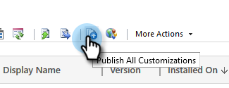

# Step 2 of 3: Set up Marketo Sync User in Dynamics {#step-of-set-up-marketo-sync-user-in-dynamics}

Step 2 of 3: Set up Marketo Sync User in Dynamics - Marketo Docs - Product Documentation

Let's get started by creating a user account.

>[!NOTE]
>
>**Prerequisites**
>
>[Step 1 of 3: Install the Marketo Solution (Online)](step-1-of-3-install-the-marketo-solution-(online).md)

### What's in this article? {#what-s-in-this-article}

[Create a new user](#step2of3-setupmarketosyncuserindynamics-createanewuser)  
[Assign Sync User Role](#step2of3-setupmarketosyncuserindynamics-assignsyncuserrole)  
[Configure Marketo Solution](#step2of3-setupmarketosyncuserindynamics-configuremarketosolution)  
[Before Proceeding to Step 3](#step2of3-setupmarketosyncuserindynamics-beforeproceedingtostep3)

#### Create a new user {#step2of3-setupmarketosyncuserindynamics-createanewuser}

##### 1. Log-in to Dynamics. Click the Settings icon and select Advanced Settings. {#step2of3-setupmarketosyncuserindynamics-log-intodynamics.clickthesettingsiconandselectadvancedsettings.}

##### 2. Click Settings and select Security. {#step2of3-setupmarketosyncuserindynamics-clicksettingsandselectsecurity.}

##### 3. Click Users. {#step2of3-setupmarketosyncuserindynamics-clickusers.}

##### 4. Click New. {#step2of3-setupmarketosyncuserindynamics-clicknew.}

##### 5. Click Add and License Users in the new window. {#step2of3-setupmarketosyncuserindynamics-clickaddandlicenseusersinthenewwindow.}

##### 6. A new tab opens. Click Admin at the top of the page. {#step2of3-setupmarketosyncuserindynamics-anewtabopens.clickadminatthetopofthepage.}

##### 7. Another new tab opens. Click Add a user. {#step2of3-setupmarketosyncuserindynamics-anothernewtabopens.clickaddauser.}

##### 8. Enter all of your information. When you're done, click Add. {#step2of3-setupmarketosyncuserindynamics-enterallofyourinformation.whenyou'redone-clickadd.}

>[!NOTE]
>
>This name must be a dedicated sync user and not an existing CRM user's account. It does not need to be an actual email address.

##### 9. Enter the email to receive the new user credentials and click Send email and close. {#step2of3-setupmarketosyncuserindynamics-entertheemailtoreceivethenewusercredentialsandclicksendemailandclose.}

#### Assign Sync User Role {#step2of3-setupmarketosyncuserindynamics-assignsyncuserrole}

Assign the Marketo Sync User role only to the Marketo sync user. You don't need to assign it to any other users.

>[!NOTE]
>
>This applies to Marketo version 4.0.0.14 and later. For earlier versions, all users must have the sync user role. To upgrade Marketo, see [Upgrade Marketo Solution for Microsoft Dynamics](../../../../../../welcome-to-marketo-docs/product-docs/crm-sync/microsoft-dynamics-sync/sync-setup/download-the-marketo-lead-management-solution/upgrade-the-marketo-solution-for-microsoft-dynamics.md).

##### 1. Go back to the Enabled Users tab and refresh the users list. {#step2of3-setupmarketosyncuserindynamics-gobacktotheenableduserstabandrefreshtheuserslist.}

##### 2. Hover next to the newly created Marketo Sync user, and a checkbox will appear. Click to select it. {#step2of3-setupmarketosyncuserindynamics-hovernexttothenewlycreatedmarketosyncuser-andacheckboxwillappear.clicktoselectit.}

##### 3. Click Manage Roles. {#step2of3-setupmarketosyncuserindynamics-clickmanageroles.}

##### 4. Check Marketo Sync User and click OK. {#step2of3-setupmarketosyncuserindynamics-checkmarketosyncuserandclickok.}

>[!NOTE]
>
>Any updates made in your CRM by the Sync User will **not** be synced back to Marketo.

#### Configure Marketo Solution {#step2of3-setupmarketosyncuserindynamics-configuremarketosolution}

Almost there! All we have left is to inform Marketo Solution about the new user created.

1. Go back to the Advanced Settings section and click the icon next to Settings, and select **Marketo Config**.

   

   >[!NOTE]
   >
   >If you don't see **Marketo Config** in the Settings menu, refresh the page. If that doesn't work, try to [publish the Marketo Solution](https://docs.marketo.com/pages/viewpage.action?pageId=3571822#publish-customizations)  again or log out and back in.

   ##### Click Default. {#step2of3-setupmarketosyncuserindynamics-clickdefault.}

   

   ##### Click the search button on the Marketo User field and select the sync user you created. {#step2of3-setupmarketosyncuserindynamics-clickthesearchbuttononthemarketouserfieldandselectthesyncuseryoucreated.}

   

   ##### Click the icon in the bottom-right corner to save the changes. {#step2of3-setupmarketosyncuserindynamics-clicktheiconinthebottom-rightcornertosavethechanges.}

   

1. Click the **X** in the upper-right to close the screen.

   

1. Click the icon next to Settings, and select **Solutions**.

   

   ##### Click the Publish All Customizations button.  
   {#step2of3-setupmarketosyncuserindynamics-clickthepublishallcustomizationsbutton.}

   

   #### Before Proceeding to Step 3 {#step2of3-setupmarketosyncuserindynamics-beforeproceedingtostep3}

    * If you want to restrict the number of records you sync, [set up a custom sync filter](../../../../../../welcome-to-marketo-docs/product-docs/crm-sync/microsoft-dynamics-sync/create-a-custom-dynamics-sync-filter.md) now.
    * Run the [Validate Microsoft Dynamics Sync](../../../../../../welcome-to-marketo-docs/product-docs/crm-sync/microsoft-dynamics-sync/sync-setup/validate-microsoft-dynamics-sync.md) process. It verifies that your initial setups were done correctly.
    * Log into the Marketo Sync User in Microsoft Dynamics CRM.

   >[!NOTE]
   >
   >**Related Articles**
   >
   >
   >[Step 3 of 3: Connect Microsoft Dynamics with Marketo (Online)](step-3-of-3-connect-microsoft-dynamics-with-marketo-(online).md)

`  
` 