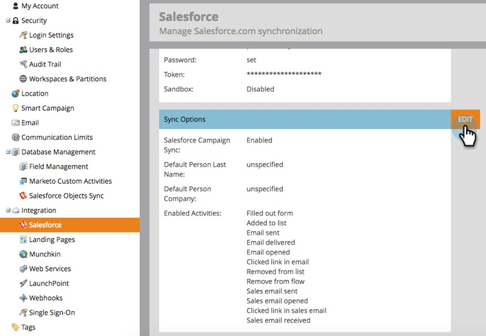

# Turn Off Email Notifications to Lead Owner {#turn-off-email-notifications-to-lead-owner}

Turn Off Email Notifications to Lead Owner - Marketo Docs - Product Documentation

You can disable the automatic email notifications that are sent to Lead Owners in Salesforce upon Lead Assignment. Here's how.

##### 1. Go to Admin.  {#turnoffemailnotificationstoleadowner-gotoadmin.}

##### 2. Click Salesforce. {#turnoffemailnotificationstoleadowner-clicksalesforce.}

##### 3. Under Sync Options, click Edit. {#turnoffemailnotificationstoleadowner-undersyncoptions-clickedit.}

##### 4. Uncheck the Send email notification to owner in Salesforce upon lead assignment box. Click Save. {#turnoffemailnotificationstoleadowner-uncheckthesendemailnotificationtoownerinsalesforceuponleadassignmentbox.clicksave.}

