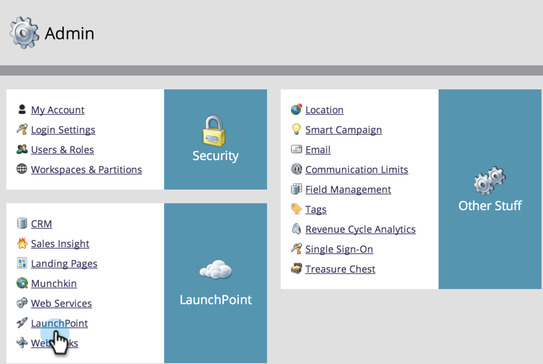
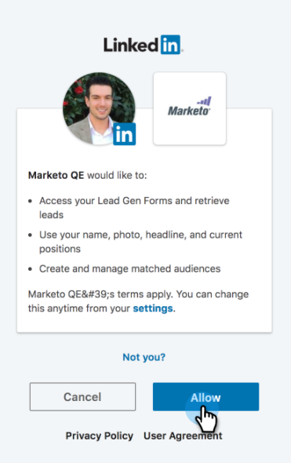

# Add LinkedIn Matched Audiences as a LaunchPoint Service {#add-linkedin-matched-audiences-as-a-launchpoint-service}

Add LinkedIn Matched Audiences as a LaunchPoint Service - Marketo Docs - Product Documentation

>[!NOTE]
>
>**Admin Permissions Required**

Connect your Marketo account with LinkedIn Matched Audiences to use a Marketo static list or smart list as a LinkedIn audience segment.

##### 1. Go to the Admin section. {#addlinkedinmatchedaudiencesasalaunchpointservice-gototheadminsection.}

##### 2. Select Launchpoint. {#addlinkedinmatchedaudiencesasalaunchpointservice-selectlaunchpoint.}

##### 3. Select New and New Service. {#addlinkedinmatchedaudiencesasalaunchpointservice-selectnewandnewservice.}

##### 4. Enter a Display Name and choose LinkedIn Matched Audiences. Click Create. {#addlinkedinmatchedaudiencesasalaunchpointservice-enteradisplaynameandchooselinkedinmatchedaudiences.clickcreate.}

##### 5. To connect a LinkedIn account, click Authorize. {#addlinkedinmatchedaudiencesasalaunchpointservice-toconnectalinkedinaccount-clickauthorize.}

>[!CAUTION]
>
>In order for Marketo to send audiences across multiple LinkedIn Ad Accounts, the LinkedIn user you authorize in the following steps needs to have access to *all* of these Ad accounts in their Campaign Manager.

##### 6. LinkedIn opens in a new tab. From here, log in to your LinkedIn account. {#addlinkedinmatchedaudiencesasalaunchpointservice-linkedinopensinanewtab.fromhere-logintoyourlinkedinaccount.}

##### 7. Review the requested permissions, then click Allow. {#addlinkedinmatchedaudiencesasalaunchpointservice-reviewtherequestedpermissions-thenclickallow.}

##### 8. Your LinkedIn account is now connected to Marketo. Click Create. {#addlinkedinmatchedaudiencesasalaunchpointservice-yourlinkedinaccountisnowconnectedtomarketo.clickcreate.}

Awesome! You'll now see LinkedIn Matched Audiences listed as a LaunchPoint service in the Installed Services tab.

>[!NOTE]
>
>**Related Articles**
>
>* [Use a Marketo List or Smart List as a LinkedIn Audience Segment](../../../../welcome-to-marketo-docs/product-docs/demand-generation/social/social-functions/use-a-marketo-list-or-smart-list-as-a-linkedin-audience-segment.md)
>

