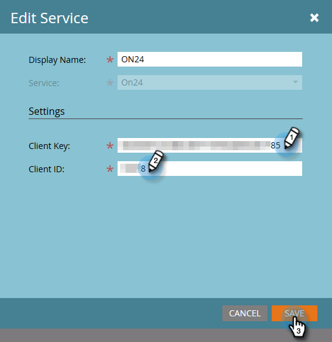

# Enter your ON24 Credentials in Marketo {#enter-your-on-credentials-in-marketo}

Enter your ON24 Credentials in Marketo - Marketo Docs - Product Documentation

Let's get started on your ON24 event integration. If you ever need to edit or delete your credentials, those steps are also included below.

### What's in this article? {#what-s-in-this-article}

[Enter Credentials](#enteryouron24credentialsinmarketo-entercredentials)  
[Edit Credentials](#enteryouron24credentialsinmarketo-editcredentials)  
[Delete a Service](#enteryouron24credentialsinmarketo-deleteaservice)

#### Enter Credentials {#enteryouron24credentialsinmarketo-entercredentials}

##### 1. Log into Marketo and click Admin. {#enteryouron24credentialsinmarketo-logintomarketoandclickadmin.}

##### 2. In Integration, click LaunchPoint. {#enteryouron24credentialsinmarketo-inintegration-clicklaunchpoint.}

##### 3. Under Installed Services, click New and then New Service. {#enteryouron24credentialsinmarketo-underinstalledservices-clicknewandthennewservice.}

##### 4. In the New Service dialog box, enter this information: {#enteryouron24credentialsinmarketo-inthenewservicedialogbox-enterthisinformation-}

* **Display Name** – Enter a name for use in Marketo. This could be your name or the name of your group if you share credentials.
* **Service** – Select **On24** from the drop-down menu.

* **Client Key** – Enter the ON24 Client Key you use for sign-in. The client key is a 32-digit string containing a mixture of letters and numbers.
* **Client ID** – Enter the 4-digit ON24 client ID you use for sign-in. You can obtain the client ID and client key directly from your ON24 Account Manager.

##### 5. Click Create. {#enteryouron24credentialsinmarketo-clickcreate.}

##### 6. When the credentials are successfully validated, they are added to the Installed Services page. If there is an error, you won't be able to save the credentials. {#enteryouron24credentialsinmarketo-whenthecredentialsaresuccessfullyvalidated-theyareaddedtotheinstalledservicespage.ifthereisanerror-youwon'tbeabletosavethecredentials.}

#### Edit Credentials {#enteryouron24credentialsinmarketo-editcredentials}

You can edit your credentials if your password expires or you need to make a change to an existing credential.

##### 1. In the Installed Services tab, select the credential you wish to edit and click Edit Service. {#enteryouron24credentialsinmarketo-intheinstalledservicestab-selectthecredentialyouwishtoeditandclickeditservice.}

##### 2. Update the information in the Edit Service dialog box and click Save. {#enteryouron24credentialsinmarketo-updatetheinformationintheeditservicedialogboxandclicksave.}

#### Delete a Service {#enteryouron24credentialsinmarketo-deleteaservice}

##### 1. In the Installed Services tab, select the service you wish to delete, click the Service Actions drop-down and select Delete Service. {#enteryouron24credentialsinmarketo-intheinstalledservicestab-selecttheserviceyouwishtodelete-clicktheserviceactionsdrop-downandselectdeleteservice.}

##### 2. Click Delete. {#enteryouron24credentialsinmarketo-clickdelete.}

Your next step is to [create your webinar event in ON24](create-your-webinar-event-in-on24.md).

>[!NOTE]
>
>**Related Articles**
>
>* [Understanding Marketo ON24 Adapter Events](understanding-marketo-on24-adapter-events.md)
>

