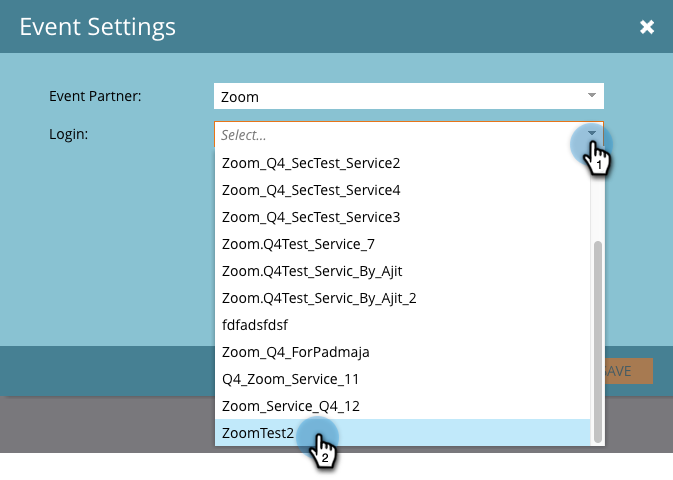

# Create an Event with Zoom {#create-an-event-with-zoom}

Create an Event with Zoom - Marketo Docs - Product Documentation

>[!NOTE]
>
>**Prerequisites**
>
>* [Add Zoom as a LaunchPoint Service](../../../../../welcome-to-marketo-docs/product-docs/administration/additional-integrations/add-zoom-as-a-launchpoint-service.md) 
>* [Create a New Event Program](../../../../../welcome-to-marketo-docs/product-docs/demand-generation/events/understanding-events/create-a-new-event-program.md)
>* Set the appropriate [flow actions](http://docs.marketo.com/display/DOCS/Flow+Actions)to track engagement
>

First create your webinar in Zoom. Certain settings in the creation of your Zoom are used by Marketo, and some are only used by Zoom.

After you create a Marketo event and associate a Zoom webinar with it, the systems will be able to share registration and attendance information. For help creating a webinar, see [Getting Started with Zoom Webinars](https://support.zoom.us/hc/en-us/articles/200917029-Getting-Started-With-Webinar).

`Enter the following information for your webinar and it will be pulled into Marketo via the` `adapter. If you make any changes to this information, you must click the link “` `Refresh from Webinar Provider` `” under` `Event Actions` `, in order for Marketo to see the changes.`

**`Title and Description`**

* `**Webinar Name** – Enter the name for the webinar. This name will be viewable in Marketo.`
* `**Description** (optional) – Enter the description for the webinar. The description will be`viewable in Marketo.

**`D`ate & Time**

* `**Start date** – Enter your start date. This will be viewable in Marketo.`
* `**Start time** – Enter your start time. This will be viewable in Marketo.`
* `**Duration** – Enter the duration. The start time and end time will be viewable in Marketo.`
* `**Time Zone** – Select the applicable time zone. This will be viewable in Marketo.`
* **Recurring Webinar ** `–` Keep unchecked.

* **Registration** `–` Check this box to make registration required. You will use a Marketo form/landing page to capture registration information that will be pushed to Zoom.

>[!NOTE]
>
>`Marketo does not currently support recurring webinars. You must set up a single session` `between each Marketo Event and Zoom webinar.`

>[!TIP]
>
>`There are additional fields that you will configure in Zoom that will NOT affect the integration. Please refer to the` [Zoom Webinar Help Center](https://support.zoom.us/hc/en-us/sections/200324965-Video-Webinar) `for additional information on these fields.`

Now, let's jump into Marketo!

##### 1. Select an event. Click Event Actions and choose Event Settings. {#createaneventwithzoom-selectanevent.clickeventactionsandchooseeventsettings.}

>[!NOTE]
>
>The channel type of the event selected must be **webinar**.

##### 2. Choose Zoom from the Event Partner List. {#createaneventwithzoom-choosezoomfromtheeventpartnerlist.}

##### 3. Choose the Zoom account you want to associate your event with. {#createaneventwithzoom-choosethezoomaccountyouwanttoassociateyoureventwith.}

##### 4. Select the webinar. {#createaneventwithzoom-selectthewebinar.}

##### 5. Click Save. {#createaneventwithzoom-clicksave.}

`Excellent! Now the event is synced and scheduled by` `Zoom.`

>[!NOTE]
>
>The fields Marketo sends over are: First Name, Last Name, Email Address.

>[!TIP]
>
>To populate your confirmation email with this unique URL, use the following token in your email: {{member.webinar url}}. When the confirmation URL is sent out, this token automatically resolves to the person's unique confirmation URL. 
>
>Set your confirmation email to **Operational** to ensure that people who register and may be unsubscribed still receive their confirmation information.

People who sign up for your webinar will get pushed to your webinar provider via the **Change Program Status** flow step when the New Status is set to "Registered." No other status will push the person over. Also, be sure to make **Change Program Status** flow step #1, and **Send Email **flow step #2.   

>[!CAUTION]
>
>Avoid using nested email programs to send out your confirmation emails. Use the event program's smart campaign instead, as shown above.

>[!TIP]
>
>It can take up to 48 hours for the data to appear in Marketo. If after waiting that long you still don't see anything, select **Refresh from Webinar Provider** from the Event Actions menu in the **Summary** tab of your event.

