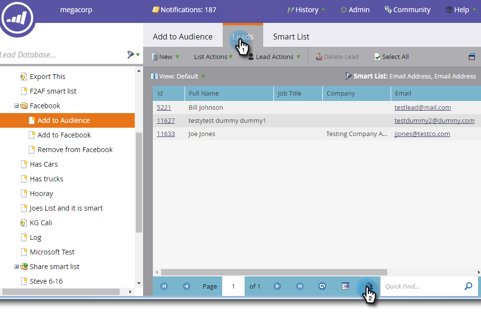

# Add Leads to a Custom Audience in Facebook {#add-leads-to-a-custom-audience-in-facebook}

Add Leads to a Custom Audience in Facebook - Marketo Docs - Product Documentation

Already have a custom audience in Facebook and want to add more leads to it? Here's how.

>[!NOTE]
>
>**Prerequisites**
>
>* [Create a Custom Audience in Facebook](create-a-custom-audience-in-facebook.md)
>* [Accept Facebook's custom audiences terms](https://www.facebook.com/ads/manage/customaudiences/tos.php) within your Facebook account.
>

##### 1. Find and select the smart or static list that contains the leads you want to add. {#addleadstoacustomaudienceinfacebook-findandselectthesmartorstaticlistthatcontainstheleadsyouwanttoadd.}

##### 2. Select the Leads tab, then click on the Send Via Ad Bridge icon at the bottom. {#addleadstoacustomaudienceinfacebook-selecttheleadstab-thenclickonthesendviaadbridgeiconatthebottom.}

##### 3. Select Facebook and click Next. {#addleadstoacustomaudienceinfacebook-selectfacebookandclicknext.}

##### 4. Click the Audience drop-down, select the audience you want to add the leads to, and click Update. {#addleadstoacustomaudienceinfacebook-clicktheaudiencedrop-down-selecttheaudienceyouwanttoaddtheleadsto-andclickupdate.}

>[!NOTE]
>
>**Add leads to audience:** only Facebook audiences with a custom sub-type will be available.  
>**Remove leads from audience**: removes the leads in your static or smart list from a Facebook audience.

##### 5. When done, the status will update. {#addleadstoacustomaudienceinfacebook-whendone-thestatuswillupdate.}

That's all there is to it!

>[!NOTE]
>
>**Related Articles**
>
>* [Create a Custom Audience in Facebook](create-a-custom-audience-in-facebook.md)
>

