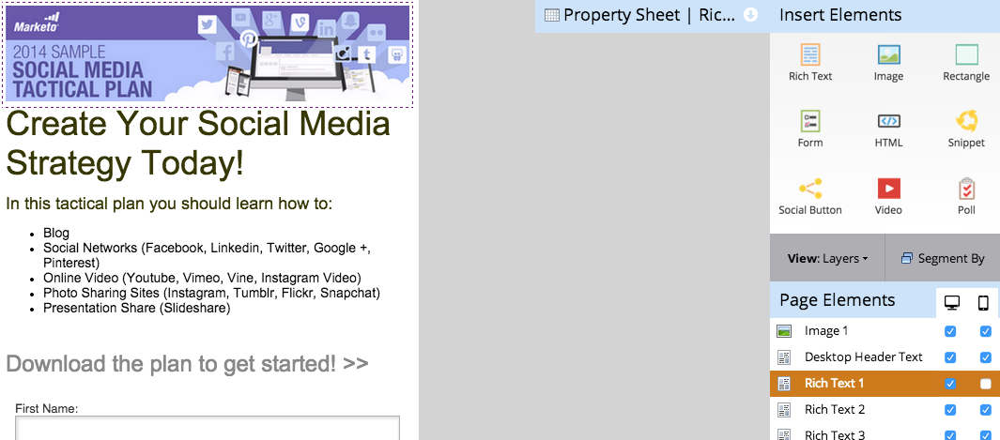
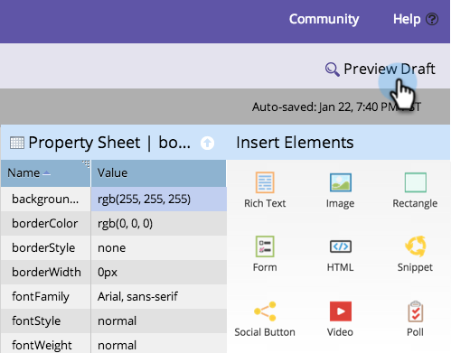

# Customize Mobile View for Your Free-Form Landing Page {#customize-mobile-view-for-your-free-form-landing-page}

Customize Mobile View for Your Free-Form Landing Page - Marketo Docs - Product Documentation

>[!NOTE]
>
>**Prerequisites**
>
>* [Add a Mobile View for Your Free-Form Landing Page](add-a-mobile-view-for-your-free-form-landing-page.md)
>

### What's in this article? {#what-s-in-this-article}

[Mobile vs. Desktop View](#customizemobileviewforyourfree-formlandingpage-mobilevs.desktopview)  
[Important Things to Know:](#customizemobileviewforyourfree-formlandingpage-importantthingstoknow-)  
[Hide an Element from the Mobile View](#customizemobileviewforyourfree-formlandingpage-hideanelementfromthemobileview)  
[Add an Element to the Mobile View](#customizemobileviewforyourfree-formlandingpage-addanelementtothemobileview)  
[Preview Mobile View](#customizemobileviewforyourfree-formlandingpage-previewmobileview)  
The mobile view of your free-form landing page is mostly automatic, but you can customize it. Here's how.

##### 1. Select your free-form landing page. {#customizemobileviewforyourfree-formlandingpage-selectyourfree-formlandingpage.}

##### 2. Click Edit Draft. {#customizemobileviewforyourfree-formlandingpage-clickeditdraft.}

##### 3. Click the Mobile tab. {#customizemobileviewforyourfree-formlandingpage-clickthemobiletab.}

#### Mobile vs. Desktop View {#customizemobileviewforyourfree-formlandingpage-mobilevs.desktopview}

Under Page Elements, you'll see a  (desktop) icon and a  (mobile) icon. This allows you to show/hide different elements dynamically.

By default, everything on the desktop view is shown on the mobile view.

>[!NOTE]
>
>Rectangles aren't shown on the mobile view.

  

#### Important Things to Know:  {#customizemobileviewforyourfree-formlandingpage-importantthingstoknow-}

* Images will expand to the width of your mobile device. If you want smaller images, pull in the rich-text element and add your image from there.
* Only use Forms 2.0 forms. They are responsive and will adjust automatically. 
* Only one template element is editable, `BODY#bodyid (Mobile)`. You can use this to change the background color.   
  

#### Hide an Element from the Mobile View {#customizemobileviewforyourfree-formlandingpage-hideanelementfromthemobileview}

>[!TIP]
>
>Less is more on mobile. Use fewer words for happier customers.

##### 1. To hide an element, click the corresponding check box under the mobile column. {#customizemobileviewforyourfree-formlandingpage-tohideanelement-clickthecorrespondingcheckboxunderthemobilecolumn.}

##### 2. Perfect! That element will no longer be visible in your mobile view. {#customizemobileviewforyourfree-formlandingpage-perfect!thatelementwillnolongerbevisibleinyourmobileview.}

#### Add an Element to the Mobile View {#customizemobileviewforyourfree-formlandingpage-addanelementtothemobileview}

>[!TIP]
>
>Make special (shorter) content just for the mobile view.

##### 1. To add an element, drag-and-drop it onto the free-form landing page. {#customizemobileviewforyourfree-formlandingpage-toaddanelement-drag-and-dropitontothefree-formlandingpage.}

Make sure the element is set to display only on the mobile view.

>[!TIP]
>
>The mobile view can also have a different arrangement of page elements. Move things around on the free-form landing page, or reorder the objects listed under **Page Elements** using drag and drop.

#### Preview Mobile View {#customizemobileviewforyourfree-formlandingpage-previewmobileview}

##### 1. Click Preview Draft. {#customizemobileviewforyourfree-formlandingpage-clickpreviewdraft.}

##### 2. Want to see something cool? Select Side By Side. {#customizemobileviewforyourfree-formlandingpage-wanttoseesomethingcool?selectsidebyside.}

##### 3. You can now see the desktop and mobile versions of your landing pages at the same time! {#customizemobileviewforyourfree-formlandingpage-youcannowseethedesktopandmobileversionsofyourlandingpagesatthesametime!}

##### 4. If you love it, click Approve and Close. {#customizemobileviewforyourfree-formlandingpage-ifyouloveit-clickapproveandclose.}

>[!NOTE]
>
>The preview is not interactive. Every smartphone displays things a bit differently. We recommend previewing your landing page on a few devices to see exactly how the landing page will behave.

Have fun! 

>[!NOTE]
>
>**Related Articles**
>
>* [Make an Existing Free-form Landing Page Template Mobile Compatible](../../../../../welcome-to-marketo-docs/product-docs/demand-generation/landing-pages/landing-page-templates/make-an-existing-free-form-landing-page-template-mobile-compatible.md)
>

