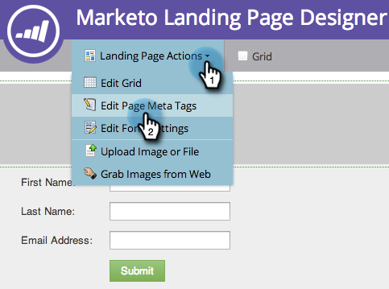
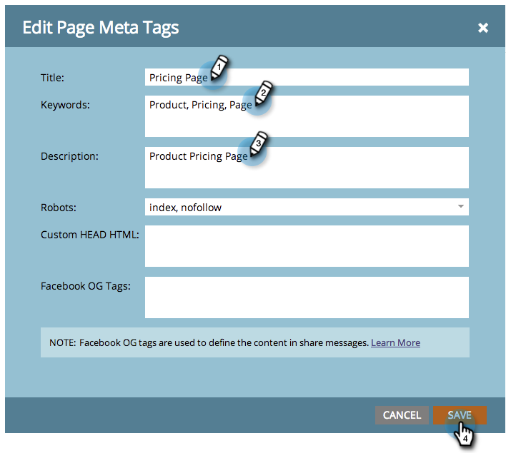

# Edit Landing Page Title and Metadata {#edit-landing-page-title-and-metadata}

Edit Landing Page Title and Metadata - Marketo Docs - Product Documentation

Marketo allows you to edit your landing page [meta tags for SEO purposes](http://www.w3schools.com/tags/tag_meta.asp) as well as customize the <head> portion of the HTML.

1. Select a landing page and click **Edit** **Draft**.

   

   >[!NOTE]
   >
   >The Landing page designer will open in a new window.

1. Under **Landing Page Actions,** click **Edit Page Meta Tags**.

   

1. Enter the **Title,** **Keywords**, and **Description** for your page. Select the desired **Robots** option and enter any custom content you want for the HTML <head> section. Click **Save.**

   

   >[!TIP]
   >
   >**What does [robots](http://www.robotstxt.org/meta.html) mean?**
   >
   >
   >**index:** page is searchable on the web. **follow:** search engines can follow links on indexed pages.

1. Edit the tags any time and approve the landing page.

