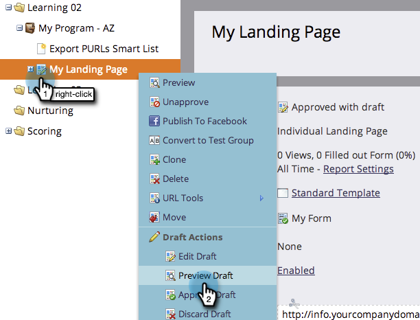

# Preview a Landing Page {#preview-a-landing-page}

Preview a Landing Page - Marketo Docs - Product Documentation

You probably want to see what your landing page looks like before making it live.

### What's in this article? {#what-s-in-this-article}

[Preview a Landing Page](#previewalandingpage-previewalandingpage)  
[Preview a Landing Page Draft](#previewalandingpage-previewalandingpagedraft)  
[Preview a Landing Page Draft While Editing](#previewalandingpage-previewalandingpagedraftwhileediting)

#### Preview a Landing Page {#previewalandingpage-previewalandingpage}

##### 1. Select a landing page and click Preview Page. {#previewalandingpage-selectalandingpageandclickpreviewpage.}

>[!NOTE]
>
>The draft is the version you are working on, not the live one customers see.

##### 2. You can also right-click your landing page and select Preview. {#previewalandingpage-youcanalsoright-clickyourlandingpageandselectpreview.}

 

#### Preview a Landing Page Draft {#previewalandingpage-previewalandingpagedraft}

##### 1. Right click an approved landing page that has a draft version and click on Preview Draft. {#previewalandingpage-rightclickanapprovedlandingpagethathasadraftversionandclickonpreviewdraft.}

 

#### Preview a Landing Page Draft While Editing {#previewalandingpage-previewalandingpagedraftwhileediting}

##### 1. Select a landing page and click Edit Draft. {#previewalandingpage-selectalandingpageandclickeditdraft.}

  

##### 2. At any point during your work in the landing page editor, you can click Preview Draft. {#previewalandingpage-atanypointduringyourworkinthelandingpageeditor-youcanclickpreviewdraft.}

  

##### 3. You can quickly return to editing by clicking Edit Draft. {#previewalandingpage-youcanquicklyreturntoeditingbyclickingeditdraft.}

Nice work! Now you know how to preview landing pages.
