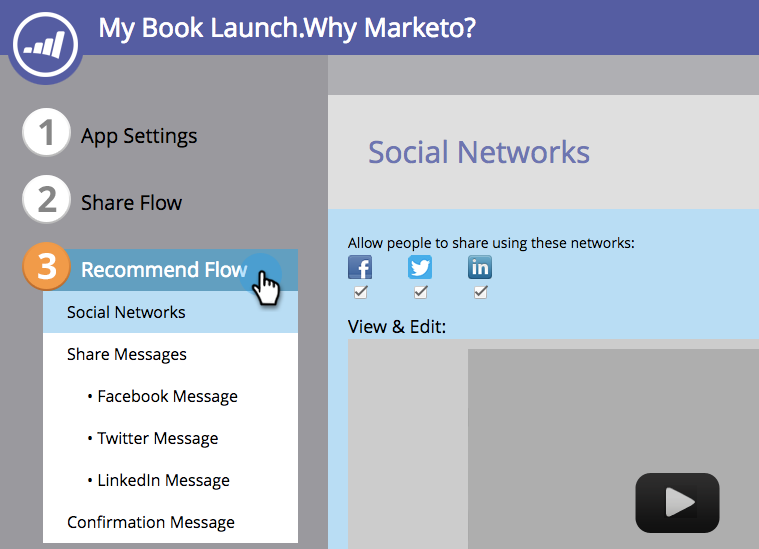
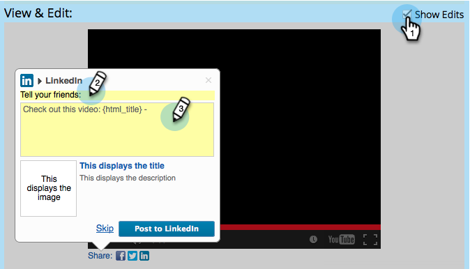

# Configure Social Recommend Flow {#configure-social-recommend-flow}

Configure Social Recommend Flow - Marketo Docs - Product Documentation

`When you create a`social app `, you can configure the social network choices and prompts that a user encounters as they sign up.`

### What's in this article? {#what-s-in-this-article}

[Select Networks for Sharing](#configuresocialrecommendflow-selectnetworksforsharing)  
[Configure the Facebook Message](#configuresocialrecommendflow-configurethefacebookmessage)  
[Configure the Twitter Message](#configuresocialrecommendflow-configurethetwittermessage)  
[Configure the LinkedIn Message](#configuresocialrecommendflow-configurethelinkedinmessage)  
[Configure the Confirmation Message](#configuresocialrecommendflow-configuretheconfirmationmessage)

#### Select Networks for Sharing {#configuresocialrecommendflow-selectnetworksforsharing}

>[!NOTE]
>
>`This is very similar to` [configuring the social sign-up/share flow](configure-social-sign-up/share-flow.md) `, but this is for the share links`*under* `the social app.`

1. Go to **Marketing Activities**.

   

1. Select the app, and click `**Edit Draft**`**.**

   

1. In the social app editor, go to `**Recommend Flow**` > `**Social Networks**`**.**

   

1. Select the networks a user can share to.

   

#### Configure the Facebook Message {#configuresocialrecommendflow-configurethefacebookmessage}

1. Configure the message that will appear in Facebook posts.

   

   >[!NOTE]
   >
   >In a video share, the thumbnail is generated automatically.

   **Add Dynamic content**If you choose** Add Static content**, enter the title, caption, and description, and upload an image. See the next two steps.

1. In the `View & Edit` window, click **Show Edits** to customize the share prompt and message that will appear in Facebook posts.

   >[!TIP]
   >
   >`For more information, see` [Edit Facebook Rich Post Settings](../../../../../welcome-to-marketo-docs/product-docs/demand-generation/facebook/edit-facebook-rich-post-settings.md) `.`

   

   >[!NOTE]
   >
   >`The` [share URL](../../../../../welcome-to-marketo-docs/product-docs/demand-generation/social/social-functions/choose-the-share-url-for-a-social-app.md) `is automatically added to all share messages.`

1. `If you chose` `**Add Static** **content**` `above, edit the title, caption, and description, and upload a custom image (from your`Marketo `Images and Files).`

   

   See [Add Images and Files to Marketo](../../../../../welcome-to-marketo-docs/product-docs/demand-generation/images-and-files/add-images-and-files-to-marketo.md).

   >[!NOTE]
   >
   >If you upload an image, you will not see it here until you close and reopen the social app editor.

1. `Click`**Next** `.`

If you choose , the values of the page's OpenGraph tags (og:title, og:caption, and og:description) and the thumbnail are automatically added to Facebook posts. See the next step. 

#### Configure the Twitter Message {#configuresocialrecommendflow-configurethetwittermessage}

1. Click to edit the share prompt and message that will appear in Twitter tweets. 

   

   >[!TIP]
   >
   >`Use` `{html_title}` `in your tweet text to display the title of the page automatically.`

1. `Click`**Next** `.`

#### Configure the LinkedIn Message {#configuresocialrecommendflow-configurethelinkedinmessage}

1. Configure the message that will appear in LinkedIn posts. 

   

   If you choose **Add Dynamic** content, the values of the pages tags (title and description), and the thumbnail, are automatically added to LinkedIn posts. See the next step.

   If you choose **Add Static** content, enter the title, caption, and description, and upload an image. See the next two steps.

1. In the `**View** & **Edit**` window, click `**Show Edits**` and edit the share prompt and message that will appear in LinkedIn posts.

   

   >[!TIP]
   >
   >`Use` `{html_title}` `in your post text to display the title of the page automatically.`

1. `If you chose` `**Add Static** content` ` above, edit the title and description, and upload a custom image (from your Mark**e**to Images and Files).`

   

   See [Add Images and Files to Marketo](../../../../../welcome-to-marketo-docs/product-docs/demand-generation/images-and-files/add-images-and-files-to-marketo.md).

   >[!NOTE]
   >
   >If you upload an image, you will not see it here until you close and reopen the social app editor.

1. `Click`**Next** `.`

#### Configure the Confirmation Message {#configuresocialrecommendflow-configuretheconfirmationmessage}

1. Edit the text of the share confirmation. 

   

1. Click **Finish** > `**Approve** and **Close**`**.**

   

>[!NOTE]
>
>**Related Articles**
>
>The next step is to [add your video share](customize-video-share-flow.md) or [poll](../../../../../welcome-to-marketo-docs/product-docs/demand-generation/social/creating-a-poll/create-a-poll.md) to a landing page, Facebook, or your own website.

