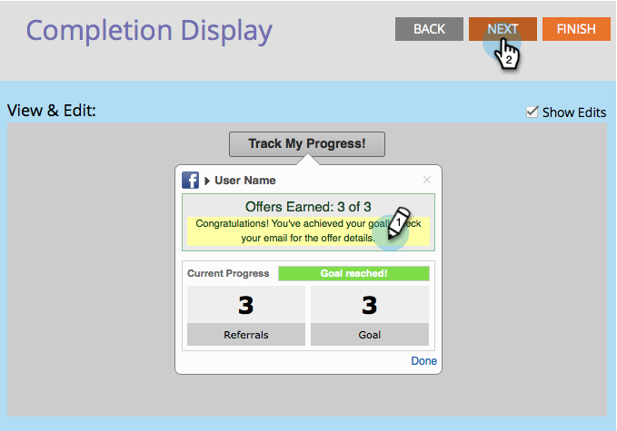

# Configure Track Progress Flow for a Referral Offer {#configure-track-progress-flow-for-a-referral-offer}

Configure Track Progress Flow for a Referral Offer - Marketo Docs - Product Documentation

`When you` [create a referral offer](../../../../../welcome-to-marketo-docs/product-docs/demand-generation/social/referral-offers/create-a-referral-offer.md) `, you can configure the prompts that show participants their progress toward the reward.`

1. Go to **Marketing Activities**.

   

1. Select the referral offer, and click **Edit Draft**.

   

1. In the referral offer editor, go to **Track Progress Flow** > **Social Networks**.

   

1. In the **View** **&** **Edit** window, edit the prompt that reminds participants to sign in to the same social network they used to sign up for your offer.

   

   >[!NOTE]
   >
   >To highlight the text you can edit, select **Show Edits** in the top-right corner.

1. Edit the prompt that encourages the participant to share the link with more friends.

   

1. Edit the prompt that informs the participant that they have met the fulfillment goal and should check their email.

   

1. Edit the message that informs a successful participant about the relevant promo codes for redeeming their reward.

   

>[!NOTE]
>
>**Related Articles**
>
>Next, click **Finish > Approve and Close** and [publish your referral offer](../../../../../welcome-to-marketo-docs/product-docs/demand-generation/social/referral-offers/publish-a-referral-offer.md).

