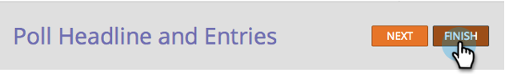
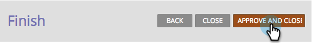

# Create a Poll {#create-a-poll}

Create a Poll - Marketo Docs - Product Documentation

`Engage people with a poll they can vote in and share with their friends on social networks. You can add it to places like your landing pages, your website, and Facebook.`  

>[!NOTE]
>
>**Availability**
>
>Not all customers have purchased this functionality. Contact your sales rep for details.

>[!NOTE]
>
>**Prerequisites**
>
>If you want to use images in your poll, add them to your Marketo Images and Files library before you begin. Add a 60x60px image for each poll entry. See [Add Images and Files to Marketo](../../../../../welcome-to-marketo-docs/product-docs/demand-generation/images-and-files/add-images-and-files-to-marketo.md).

##### 1. Inside your program, select New > New Local Asset. {#createapoll-insideyourprogram-selectnew>newlocalasset.}

  

##### 2. In the Local Asset Gallery, click Poll. {#createapoll-inthelocalassetgallery-clickpoll.}

  

##### 3. Name your poll. {#createapoll-nameyourpoll.}

>[!TIP]
>
>`To save time, you can use the` `**Clone From**` `option to copy all settings from an existing video share.`

The poll editor opens in a new window. The default settings are all good, but you still need to add your poll entries. We'll show you how in the next steps.  

##### 4. Give your poll a headline (usually a short question). {#createapoll-giveyourpollaheadline(usuallyashortquestion).}

  

##### 5. For each entry, edit the title and description. {#createapoll-foreachentry-editthetitleanddescription.}

  

##### 6. To add an entry, click the + symbol and edit the title and description. {#createapoll-toaddanentry-clickthe+symbolandeditthetitleanddescription.}

  

##### 7. For each entry, you can add an image by clicking the numbered thumbnail. {#createapoll-foreachentry-youcanaddanimagebyclickingthenumberedthumbnail.}

  

##### 8. Select the image you need, then click Select. {#createapoll-selecttheimageyouneed-thenclickselect.}

  

##### 9. When you have set the thumbnail, title, and description for all entries, click Finish. {#createapoll-whenyouhavesetthethumbnail-title-anddescriptionforallentries-clickfinish.}

  

##### 10. Click Approve and Close. {#createapoll-clickapproveandclose.}

>[!TIP]
>
>`To change any of the defaults in your poll, click`**Back** `. To save your work for later without approving, click`**Close** `.`

`If there are any problems in the poll, you will be prompted to address them before the poll is approved.` Congratulations! You have created your poll.

>[!NOTE]
>
>**Related Articles**
>
>The next step is to [publish your poll](publish-a-poll.md), but you can change the settings of your poll if necessary. Start with [customizing the poll settings](customize-poll-settings.md).

