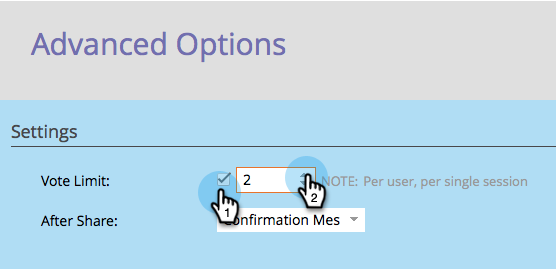

# Customize Poll Settings {#customize-poll-settings}

Customize Poll Settings - Marketo Docs - Product Documentation

When you [create a poll](create-a-poll.md), you can limit the number of votes allowed per social profile.

1. Go to **Marketing Activities**.

   

1. Select the poll, and click **Edit Draft.**

   

1. In the poll editor, go to **App Settings** > **Advanced Options.**

   

1. Check the option to impose a **Vote Limit** and enter the maximum number of votes allowed.

   

>[!TIP]
>
>You can click **Finish > Approve and Close** to [publish your poll](publish-a-poll.md), or you can continue customizing it. For example, try [configuring the after-share prompts](../../../../../welcome-to-marketo-docs/product-docs/demand-generation/social/configuring-social-actions/configure-after-share-prompts.md).

