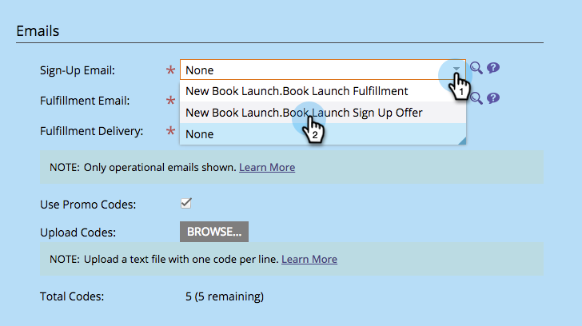
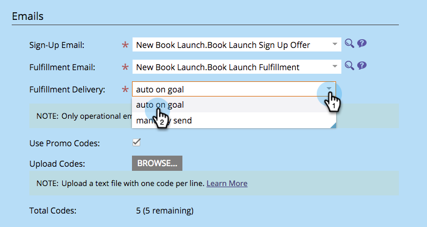
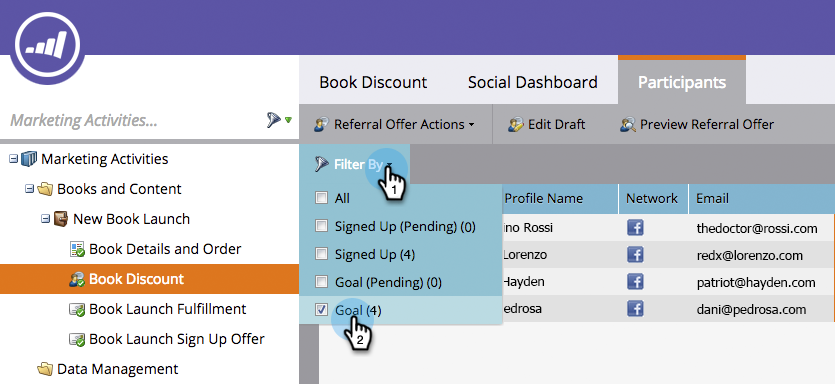

# Send Referral Offer Fulfillment Email {#send-referral-offer-fulfillment-email}

Send Referral Offer Fulfillment Email - Marketo Docs - Product Documentation

Reward your customers with coupons and discount codes using the offer fulfillment email.

>[!NOTE]
>
>**Prerequisites**
>
>* [Use Emails in Social Promotions](../../../../../welcome-to-marketo-docs/product-docs/demand-generation/social/social-functions/use-emails-in-social-promotions.md)
>* [Create a Referral Offer](create-a-referral-offer.md)
>

#### Set Up Fulfillment Delivery {#sendreferralofferfulfillmentemail-setupfulfillmentdelivery}

##### 1. Select the referral offer. Click Edit Draft. {#sendreferralofferfulfillmentemail-selectthereferraloffer.clickeditdraft.}

##### 2. Under App Settings, select Offer Details. {#sendreferralofferfulfillmentemail-underappsettings-selectofferdetails.}

** 

**

##### 3. Select a Sign-Up Email. {#sendreferralofferfulfillmentemail-selectasign-upemail.}

##### 4. Select a Fulfillment Email. {#sendreferralofferfulfillmentemail-selectafulfillmentemail.}

>[!NOTE]
>
>**Deep Dive**
>
>Learn more about [using emails in social promotions](../../../../../welcome-to-marketo-docs/product-docs/demand-generation/social/social-functions/use-emails-in-social-promotions.md).

##### 5. Click the Fulfillment Delivery drop-down and select auto on goal. {#sendreferralofferfulfillmentemail-clickthefulfillmentdeliverydrop-downandselectautoongoal.}

The message selected within **Fulfillment Email** will be automatically sent to people who meet the goal.

#### Manual Send {#sendreferralofferfulfillmentemail-manualsend}

You can send a fulfillment email manually to a person once they've met the goal.

##### 1. Select the referral offer and click the Participants tab. {#sendreferralofferfulfillmentemail-selectthereferralofferandclicktheparticipantstab.}

##### 2. Click the Filter By option and select Goal. {#sendreferralofferfulfillmentemail-clickthefilterbyoptionandselectgoal.}

>[!NOTE]
>
>This selects people who have met the referral offer goal.

  

##### 3. Select the people in the filtered view. {#sendreferralofferfulfillmentemail-selectthepeopleinthefilteredview.}

##### 4. Right-click and select Send Fulfillment Email. {#sendreferralofferfulfillmentemail-right-clickandselectsendfulfillmentemail.}

Awesome! Those people will now receive the fulfillment email and be stoked about their reward. 
