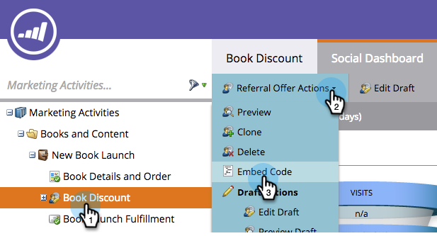
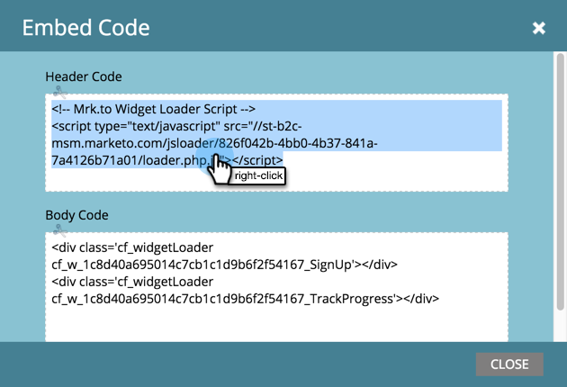

# Conversion Script for Custom Events {#conversion-script-for-custom-events}

Conversion Script for Custom Events - Marketo Docs - Product Documentation

You define the fulfillment goal when creating a referral offer. If the action that counts towards the goal is a specific event on your own web page, you can use a conversion script to call our JavaScript API.

### What's in this article? {#what-s-in-this-article}

[Retrieve the Conversion Script](#conversionscriptforcustomevents-retrievetheconversionscript)  
[Retrieve the Loader Script](#conversionscriptforcustomevents-retrievetheloaderscript)  
[Pasting the Scripts Onto Your Webpage](#conversionscriptforcustomevents-pastingthescriptsontoyourwebpage)  
[Connecting the Conversion Script](#conversionscriptforcustomevents-connectingtheconversionscript)

#### Retrieve the Conversion Script {#conversionscriptforcustomevents-retrievetheconversionscript}

##### 1. Within the referral offer editor, click Offer Details and then select Customer JavaScript Event from the fulfillment goal drop down. {#conversionscriptforcustomevents-withinthereferraloffereditor-clickofferdetailsandthenselectcustomerjavascripteventfromthefulfillmentgoaldropdown.}

##### 2. Copy the top script in the grey box and place it on your webpage within the <body> tags. The bottom script is placed within the <header> tags. {#conversionscriptforcustomevents-copythetopscriptinthegreyboxandplaceitonyourwebpagewithinthe<body>tags.thebottomscriptisplacedwithinthe<header>tags.}

>[!NOTE]
>
>**Reminder**
>
>Remember to copy and paste both scripts if they are going on a non-Marketo website.

#### Retrieve the Loader Script {#conversionscriptforcustomevents-retrievetheloaderscript}

##### 1. Select the referral offer from the tree, then click Referral Offer Actions and Embed Code. {#conversionscriptforcustomevents-selectthereferralofferfromthetree-thenclickreferralofferactionsandembedcode.}

##### 2. Right-click the Header Code and insert it into your webpage header. Then do the same for the Body Code. {#conversionscriptforcustomevents-right-clicktheheadercodeandinsertitintoyourwebpageheader.thendothesameforthebodycode.}

#### Pasting the Scripts Onto Your Webpage {#conversionscriptforcustomevents-pastingthescriptsontoyourwebpage}

##### Paste the conversion scripts into the HTML for the body and header. Next, place the loader scripts into the HTML for the body and header. {#conversionscriptforcustomevents-pastetheconversionscriptsintothehtmlforthebodyandheader.next-placetheloaderscriptsintothehtmlforthebodyandheader.}

#### Connecting the Conversion Script {#conversionscriptforcustomevents-connectingtheconversionscript}

##### Here's where you will write a JavaScript function that uses the specific HTML id of whatever page element you want to trigger goal completion on. For example: {#conversionscriptforcustomevents-here'swhereyouwillwriteajavascriptfunctionthatusesthespecifichtmlidofwhateverpageelementyouwanttotriggergoalcompletionon.forexample-}

`<pre><em><!-- Referral offer conversion script --></em></pre>` `<pre>` In this example there is a button on the webpage with an id of "#myButtonId." When that button is clicked, the person will be registered as having completed the goal.

Awesome! Your website is now capturing custom social promotion goals with Marketo.

>[!NOTE]
>
>**Related Articles**
>
>* [Specify Goal for Referral Offer](../../../../../welcome-to-marketo-docs/product-docs/demand-generation/social/referral-offers/specify-goal-for-referral-offer.md)
>* [Create a Referral Offer](../../../../../welcome-to-marketo-docs/product-docs/demand-generation/social/referral-offers/create-a-referral-offer.md)
>* [Deploy Social on Your Website](deploy-social-on-your-website.md)
>

