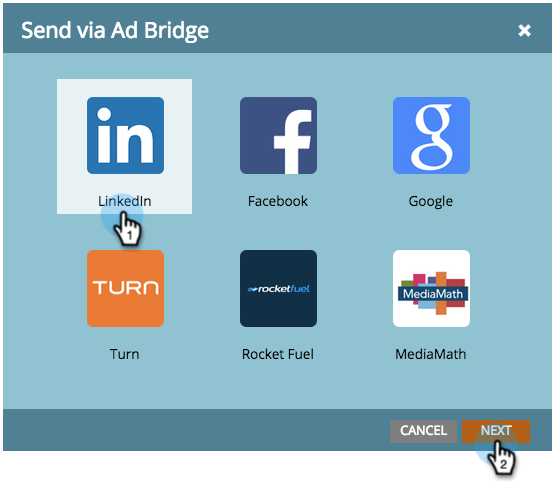

# Use a Marketo List or Smart List as a LinkedIn Audience Segment {#use-a-marketo-list-or-smart-list-as-a-linkedin-audience-segment}

Use a Marketo List or Smart List as a LinkedIn Audience Segment - Marketo Docs - Product Documentation

Integrate your Marketo people with your LinkedIn audiences.

>[!NOTE]
>
>**Prerequisites**
>
>* [Add LinkedIn Matched Audiences as a LaunchPoint Service](../../../../../welcome-to-marketo-docs/product-docs/demand-generation/ad-network-integrations/add-linkedin-matched-audiences-as-a-launchpoint-service.md)
>

##### 1. Go to the Database. {#useamarketolistorsmartlistasalinkedinaudiencesegment-gotothedatabase.}

##### 2. Select a smart list. {#useamarketolistorsmartlistasalinkedinaudiencesegment-selectasmartlist.}

##### 3. Click the People tab. {#useamarketolistorsmartlistasalinkedinaudiencesegment-clickthepeopletab.}

##### 4. Click the Send Via Ad Bridge icon  at the bottom of the list. {#useamarketolistorsmartlistasalinkedinaudiencesegment-clickthesendviaadbridgeiconatthebottomofthelist.}

>[!NOTE]
>
>When using ad network integrations to send an audience to LinkedIn, Marketo only sends the email address over.

##### 5. Select LinkedIn and click Next. {#useamarketolistorsmartlistasalinkedinaudiencesegment-selectlinkedinandclicknext.}

##### 6. Select a LinkedIn Audience. {#useamarketolistorsmartlistasalinkedinaudiencesegment-selectalinkedinaudience.}

>[!NOTE]
>
>Clicking **+New Audience** will create an audience in LinkedIn Campaign Manager.

>[!NOTE]
>
>LinkedIn deprecated the APIs used for the “Clear audience and add leads” push type in March 2018. This option is no longer available as of Marketo's Q1 2018 Release.

##### 7. Select a Push Type. Click Update. {#useamarketolistorsmartlistasalinkedinaudiencesegment-selectapushtype.clickupdate.}

>[!NOTE]
>
>Please allow 15 minutes for the sync to take place.

`High five! Your data will now jibe with LinkedIn's audiences. For information on uploading lists to LinkedIn for Account and Contact Targeting, visit` [LinkedIn's Marketing Solutions help center](https://www.linkedin.com/help/lms/answer/73938?query=ad%20segment) `.` 