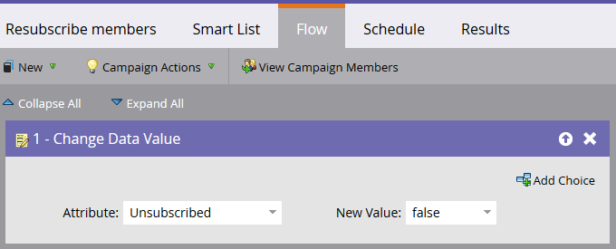

# Durable Unsubscribe {#durable-unsubscribe}

Durable Unsubscribe - Marketo Docs - Product Documentation

Marketo has enhanced the behavior of the unsubscribe functionality to make it “durable." We've added a master email status, which is separate from the unsubscribe flag visible on the person detail record.

If the unsubscribe flag is set from false to true, the master email status is updated, and the change is propagated to other people with the same email address. If a person is removed and recreated, or if a new record is created with the same email address, the unsubscribe flag will **not** be overwritten.

>[!NOTE]
>
>Durable Unsubscribe works across all partitions in your entire Marketo database.

####

### What's in this article? {#what-s-in-this-article}

[What's in this article?](#durableunsubscribe-44)  
[Update the Unsubscribe Flag from True to False (e.g., Re-subscribe a Person)](#durableunsubscribe-updatetheunsubscribeflagfromtruetofalse(e.g.-re-subscribeaperson))  
[Creating a New Person](#durableunsubscribe-creatinganewperson)  
[Changing an Email Address](#durableunsubscribe-changinganemailaddress)  
[Re-subscribing](#durableunsubscribe-re-subscribing)  
[Activity Log](#durableunsubscribe-activitylog)  
{#durableunsubscribe-44}

#### Update the Unsubscribe Flag from True to False (e.g., Re-subscribe a Person) {#durableunsubscribe-updatetheunsubscribeflagfromtruetofalse(e.g.-re-subscribeaperson)}

There are several ways a person can be re-subscribed.

`In Salesforce, **clear** the Email Opt Out field on the lead/contact's record. This will sync to Marketo.`

`   
`

`In Marketo, **clear** the unsubscribed box in the Info tab of the person's record.`

`   
`

`Run a **Change Data Value** flow step as shown below on one or many people.`

`   
`

`Update an existing person via SOAP API.`

#### Creating a New Person {#durableunsubscribe-creatinganewperson}

When a new person is created, Marketo checks it against the master email status table. If the person was previously unsubscribed, we'll update the record to be unsubscribed.

#### Changing an Email Address {#durableunsubscribe-changinganemailaddress}

If you change the email address of a person to an unsubscribed email address, that person will be unsubscribed. This change can occur in either Marketo or Salesforce.

If you change an unsubscribed email address to one that is subscribed, that person will become subscribed.

#### Re-subscribing {#durableunsubscribe-re-subscribing}

Just as an unsubscribe would cause all people with the same email address to become unsubscribed, a resubscribe would in fact resubscribe every person with the same email address.

#### Activity Log {#durableunsubscribe-activitylog}

Data Value Change definitions for *updateLeadEmailStatus* and *resetLeadEmailStatus* can be found in [this Community article](http://nation.marketo.com/t5/Knowledgebase/Durable-Unsubscribe-Activity-Log/ta-p/252688).

>[!NOTE]
>
>**Related Articles**
>
>[Understanding Unsubscribe](understanding-unsubscribe.md)

