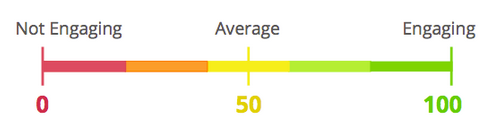

# Understanding the Engagement Score {#understanding-the-engagement-score}

Understanding the Engagement Score - Marketo Docs - Product Documentation

The engagement score makes it easy to see how effective the content in your engagement program is. The score ranges from 0 to 100. Check out [the Engagement Dashboard](the-engagement-dashboard.md) to see how you can track your content's performance.

The score is based on a proprietary algorithm that takes into account engaged behavior (Open, Click, Program Success) and disengaged behavior (Unsubscribe). It's benchmarked against drip and nurture style emails to give an average of 50. To give people a chance to engage with your content, the engagement score is calculated 72 hours after each cast.

>[!NOTE]
>
>When programs are used as content in streams, the engagement score is based on program membership and success status, **not** email interaction (clicks, opens, unsubscribes).

Engagement scores are universal for all customers. You can compare them to see who has the most engaging content. 

>[!NOTE]
>
>The proprietary algorithm also applies to the engagement score in email programs.

>[!NOTE]
>
>**Related Articles**
>
>* [Understanding Engagement Programs](../../../../../welcome-to-marketo-docs/product-docs/email-marketing/drip-nurturing/creating-an-engagement-program/understanding-engagement-programs.md)
>

