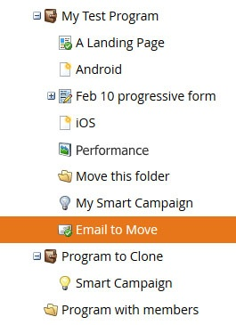

# Move an Email {#move-an-email}

Move an Email - Marketo Docs - Product Documentation

Need to move an email from one program to another? Here's how.

##### 1. Go to Marketing Activities. {#moveanemail-gotomarketingactivities.}

##### 2. Locate the email you want to move, right-click on it, and select Move. {#moveanemail-locatetheemailyouwanttomove-right-clickonit-andselectmove.}

##### 3. Click the Move To drop-down and select Marketing Activities. {#moveanemail-clickthemovetodrop-downandselectmarketingactivities.}

>[!NOTE]
>
>In this example we're moving an email to another program, but you can also move an email to a folder in the Design Studio.

##### 4. Click the Program drop-down, find and select the destination program, and click Move. {#moveanemail-clicktheprogramdrop-down-findandselectthedestinationprogram-andclickmove.}

You'll see your email now lives in the other program.

Pretty nifty!
