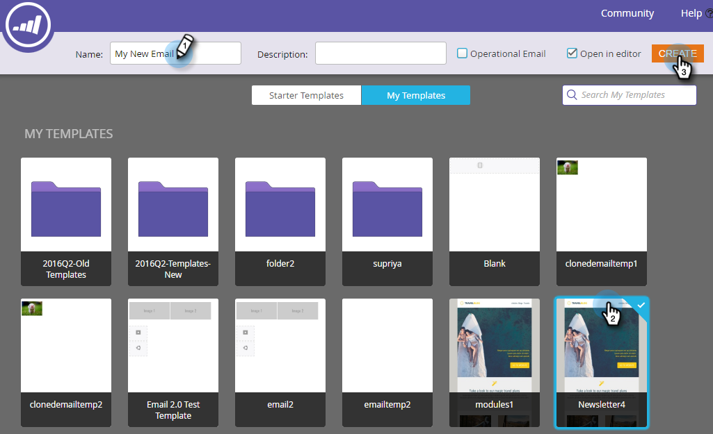

# Create an Email {#create-an-email}

Create an Email - Marketo Docs - Product Documentation

There are two main ways to create an email in Marketo. Let's look at both.

#### Create an Email in the Design Studio {#createanemail-createanemailinthedesignstudio}

##### 1. Go to the Design Studio. {#createanemail-gotothedesignstudio.}

##### 2. Click the New drop-down and select New Email. {#createanemail-clickthenewdrop-downandselectnewemail.}

>[!NOTE]
>
>When you create an email in the Design Studio, it can be found in the tree under "Emails."

Simple! Now for the other way... 

#### Create an Email in Marketing Activities {#createanemail-createanemailinmarketingactivities}

##### 1. Go to Marketing Activities. {#createanemail-gotomarketingactivities.}

##### 2. Select the program you want to add the email to, click the New drop-down and select New Local Asset. {#createanemail-selecttheprogramyouwanttoaddtheemailto-clickthenewdrop-downandselectnewlocalasset.}

##### 3. Click Email. {#createanemail-clickemail.}

And that's it!

Whichever method you choose brings you to the template picker.

##### 1. Give your email a name, click on the template you want to use, then click Create. {#createanemail-giveyouremailaname-clickonthetemplateyouwanttouse-thenclickcreate.}

>[!NOTE]
>
>You can choose from a collection of ready-to-go responsive email templates, or a template you saved by first selecting **My Templates**, and following the same steps.

##### 2. Enter a subject line. There's a counter on the right to let you know if you're under the recommended 50 character max. {#createanemail-enterasubjectline.there'sacounterontherighttoletyouknowifyou'reundertherecommended50charactermax.}

   
Depending on the template you've chosen, you'll have different options in which to edit your email. For emails with modules, check out [Add Modules to your Email](../../../../../welcome-to-marketo-docs/product-docs/email-marketing/general/email-editor-2.0/add-modules-to-your-email.md).

Your email is now created, so edit away!

>[!NOTE]
>
>**Related Articles**
>
>[Edit Your Email Header](edit-your-email-header.md)

