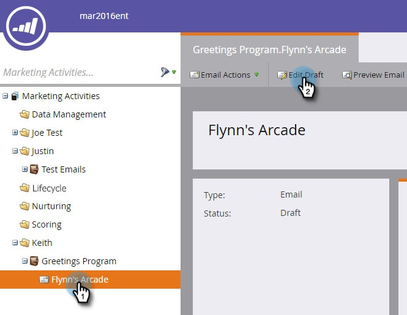
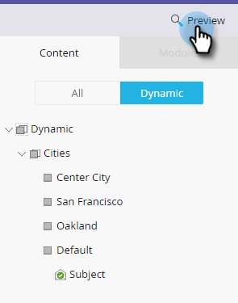

# Send a Sample Email {#send-a-sample-email}

Send a Sample Email - Marketo Docs - Product Documentation

`It's quick and easy to send samples of an email. To send a dynamic content email, see` [Preview an Email with Dynamic Content](../../../../../welcome-to-marketo-docs/product-docs/email-marketing/general/functions-in-the-editor/preview-an-email-with-dynamic-content.md) `.`

>[!NOTE]
>
>**FYI**
>
>Marketo is now standardizing language across all subscriptions, so you may see lead/leads in your subscription and person/people in docs.marketo.com. These terms mean the same thing; it does not affect article instructions. There are some other changes, too. [Learn more](http://docs.marketo.com/display/DOCS/Updates+to+Marketo+Terminology).

### What's in this article? {#what-s-in-this-article}

[Send a Sample Email](#sendasampleemail-sendasampleemail)  
[Send a Sample Email While Editing](#sendasampleemail-sendasampleemailwhileediting)  
[Send a Sample Email Based on a Segment](#sendasampleemail-sendasampleemailbasedonasegment)

>[!NOTE]
>
>You must have the **Access Database - Run Single Flow Actions** permission to send sample emails.

#### Send a Sample Email {#sendasampleemail-sendasampleemail}

##### 1. Find and select your email. Click the Email Actions drop-down and select Send Sample.  

{#sendasampleemail-findandselectyouremail.clicktheemailactionsdrop-downandselectsendsample.}

>[!NOTE]
>
>My Tokens resolves to the value appropriate to the email’s program.

##### 2. Enter an email address for delivery and click Send. {#sendasampleemail-enteranemailaddressfordeliveryandclicksend.}

>[!NOTE]
>
>**Reminder**
>
>To enter multiple email addresses, use commas to separate them.

>[!TIP]
>
>If you want to resolve tokens as a specific person, choose said person in the **person drop-down** in Step 2.

#### Send a Sample Email While Editing {#sendasampleemail-sendasampleemailwhileediting}

##### 1. Find your email, select it and click the Edit Draft tab. {#sendasampleemail-findyouremail-selectitandclicktheeditdrafttab.}

##### 2. Click Email Actions, select Send Sample. {#sendasampleemail-clickemailactions-selectsendsample.}

##### 3. Enter an email address for delivery and click Send. {#sendasampleemail-enteranemailaddressfordeliveryandclicksend..1}

>[!NOTE]
>
>The trigger field is only applicable for those utilizing [email scripting](http://developers.marketo.com/documentation/velocity-script/).

#### Send a Sample Email Based on a Segment {#sendasampleemail-sendasampleemailbasedonasegment}

>[!NOTE]
>
>**Prerequisites**
>
>[Apply segmentation to your email](http://docs.marketo.com/display/public/DOCS/Using+Dynamic+Content+in+an+Email).

##### 1. Find your email, select it and click the Edit Draft tab. {#sendasampleemail-findyouremail-selectitandclicktheeditdrafttab..1}

##### 2. Click Preview. {#sendasampleemail-clickpreview.}

##### 3. Click the View By drop-down and select Segmentation. {#sendasampleemail-clicktheviewbydrop-downandselectsegmentation.}

##### 4. A drop-down appears with available segmentations. Click it and select your desired one. {#sendasampleemail-adrop-downappearswithavailablesegmentations.clickitandselectyourdesiredone.}

##### 5. Use the arrows to scroll through your options (in this case we dynamically changed the subject line). {#sendasampleemail-usethearrowstoscrollthroughyouroptions(inthiscasewedynamicallychangedthesubjectline).}

##### 6. Click Send Sample to receive a test email of your segment in action. {#sendasampleemail-clicksendsampletoreceiveatestemailofyoursegmentinaction.}

>[!TIP]
>
>You can also send a sample email based on a segment in the edit mode of your email. Click the **Email Actions** drop-down, select **Send Sample**, then choose your segment.

##### Sampling your content before launching a campaign is very important. Measure twice, cut once! {#sendasampleemail-samplingyourcontentbeforelaunchingacampaignisveryimportant.measuretwice-cutonce!}

