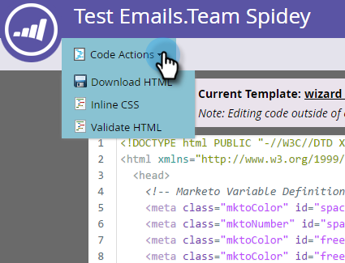

# Edit an Email's HTML {#edit-an-email-s-html}

Edit an Email's HTML - Marketo Docs - Product Documentation

Sometimes you may need to modify an email's underlying HTML. Sometimes you may use an external system to design and build your email's code. Either way, you can easily import and/or edit code from within the email editor.

### What's in this article? {#what-s-in-this-article}

[Edit HTML](#editanemail'shtml-edithtml)  
[Breaking an Email From its Template](#editanemail'shtml-breakinganemailfromitstemplate)  
[Search Code](#editanemail'shtml-searchcode)

#### Edit HTML {#editanemail'shtml-edithtml}

##### 1. Select your email and click Edit Draft. {#editanemail'shtml-selectyouremailandclickeditdraft.}

##### 2. Click Edit Code.  {#editanemail'shtml-clickeditcode.}

`   
`

##### 3. Make any changes. Click Save when done. {#editanemail'shtml-makeanychanges.clicksavewhendone.}

`   
`

>[!NOTE]
>
>Change whatever you want. You can replace the entire HTML or make minor adjustments.

##### 4. Click the Code Actions drop-down to download the code as an .html file, inline your CSS, or validate the HTML. {#editanemail'shtml-clickthecodeactionsdrop-downtodownloadthecodeasan.htmlfile-inlineyourcss-orvalidatethehtml.}

>[!NOTE]
>
>The best practice for emails is to make all your styles inline. Several email clients don't support CSS within the <head> section.

#### Breaking an Email From its Template {#editanemail'shtml-breakinganemailfromitstemplate}

These code changes **will not** break an email from its template:

* Editing the contents of any Module (including adding new Elements inside the Module)
* Adding a new Module to the Container
* Deleting a Module from the Container

* Changing mkto-specific attributes (for example, "mktoName" or "mktoImgUrl") of any Element outside of a Module
* Editing the contents of any Element (rich text, image, video, etc.) outside of a Module

These things you can do in the code editor **will **break the email from its template:

* Changing anything in the code outside of an Element or Module
* Adding or changing non-mkto attributes (for example, "id" or "style") of any Element outside of a Module
* Deleting an Element that is outside of a Module

#### Search Code {#editanemail'shtml-searchcode}

Use the Search Code functionality to efficiently find and replace content within your email’s HTML code.

##### 1. In your email's code, click Search Code. {#editanemail'shtml-inyouremail'scode-clicksearchcode.}

##### 2. Enter what you want to find and click Find Next to search forward or Find Previous to search backwards. You also have the option to Replace and Replace All. {#editanemail'shtml-enterwhatyouwanttofindandclickfindnexttosearchforwardorfindprevioustosearchbackwards.youalsohavetheoptiontoreplaceandreplaceall.}

##### 3. Click Close when done. {#editanemail'shtml-clickclosewhendone.}

>[!NOTE]
>
>Search Code is also available in the [Email Template editor](http://docs.marketo.com/display/DOCS/Create+a+New+Email+Template).

We recommend that you continue to edit your emails using Marketo's built-in functionality, but this code editor does provide flexibility if you need it.
