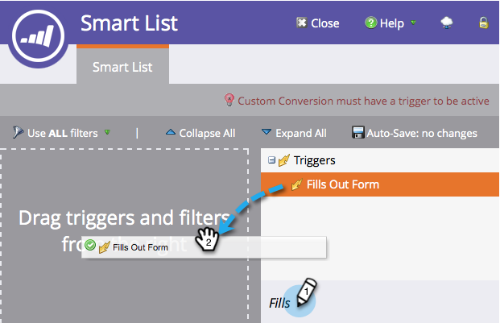

# Champion/Challenger: Define Champion Criteria {#champion-challenger-define-champion-criteria}

Champion/Challenger: Define Champion Criteria - Marketo Docs - Product Documentation

Once you've set up your test type, you need to define the champion criteria. Here's how.

>[!NOTE]
>
>**Prerequisites**
>
>* [Add an Email Champion/Challenger](../../../../../../../../welcome-to-marketo-docs/product-docs/email-marketing/general/functions-in-the-editor/email-tests---champion/challenger/add-an-email-champion/challenger.md)
>

### What's in this article? {#what-s-in-this-article}

[Standard Champion Criteria](#champion/challenger-definechampioncriteria-standardchampioncriteria)  
[Custom Champion Criteria](#champion/challenger-definechampioncriteria-customchampioncriteria)

####  Standard Champion Criteria {#champion/challenger-definechampioncriteria-standardchampioncriteria}

1. Pick one of the available **Champion Criteria**.

   

   >[!NOTE]
   >
   >We'll track this metric and send you a report with the data by email.

1. If you picked one of the default **Champion Criteria**, go ahead and move on to [Champion/Challenger: Configure Report Alerts](challenger-configure-report-alerts.md)!

   #### Custom Champion Criteria {#champion/challenger-definechampioncriteria-customchampioncriteria}

1. If you want to get fancy, you can go custom by selecting **Custom Conversion** and clicking **Edit**.

   

   >[!NOTE]
   >
   >This allows you to set any event as a conversion by using triggers and filters.

1. A window will pop up - find the trigger of your choice and drag it into the canvas.

   

1. Define the trigger.

   

   Marketo only allows triggers for people who have been sent the email from this email program. No need to add a "Was Sent Email" filter.

1. Click **Close**.

   

   Great! Now it's time to schedule the report.

   >[!NOTE]
   >
   >**Related Articles**
   >
   >    
   >    
   >    * [Champion/Challenger: Configure Report Alerts](challenger-configure-report-alerts.md)
   >    
   >

