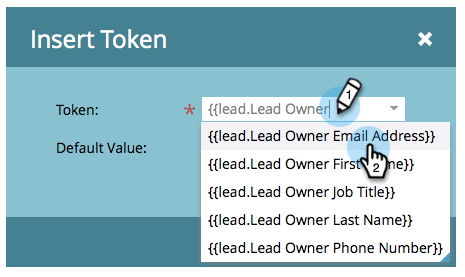

# Send Emails from the Lead Owner {#send-emails-from-the-lead-owner}

Send Emails from the Lead Owner - Marketo Docs - Product Documentation

What if you want to send an email to a lead on behalf of the Lead Owner? Here's how.

1. Find your email, select it and click **Edit Draft**.

   

   ##### Click in the From field (delete any existing name), and click the Insert Token button. {#sendemailsfromtheleadowner-clickinthefromfield(deleteanyexistingname)-andclicktheinserttokenbutton.}

   

   ##### Start typing "{{lead.Lead Owner" and select the {{lead.Lead Owner First Name}} token. {#sendemailsfromtheleadowner-starttyping"{{lead.leadowner"andselectthe{{lead.leadownerfirstname}}token.}

   

   ##### Enter a default value in case the lead does not yet have a lead owner and click Insert. {#sendemailsfromtheleadowner-enteradefaultvalueincasetheleaddoesnotyethavealeadownerandclickinsert.}

   

   ##### Click after the first token, add a space, then click the Insert Token button. {#sendemailsfromtheleadowner-clickafterthefirsttoken-addaspace-thenclicktheinserttokenbutton.}

   

   ##### Start typing "{{lead.Lead Owner" and select the {{lead.Lead Owner Last Name}} token. {#sendemailsfromtheleadowner-starttyping"{{lead.leadowner"andselectthe{{lead.leadownerlastname}}token.}

   

   ##### Enter a default value in case the lead does not yet have a lead owner and click Insert. {#sendemailsfromtheleadowner-enteradefaultvalueincasetheleaddoesnotyethavealeadownerandclickinsert..1}

   

   >[!TIP]
   >
   >Make sure you added a space between the first and last name tokens.

   ##### Click in the From Email field (delete any existing email address), and click the Insert Token button. {#sendemailsfromtheleadowner-clickinthefromemailfield(deleteanyexistingemailaddress)-andclicktheinserttokenbutton.}

   

   ##### Start typing "{{lead.Lead Owner" and select the {{lead.Lead Owner Email Address}} token. {#sendemailsfromtheleadowner-starttyping"{{lead.leadowner"andselectthe{{lead.leadowneremailaddress}}token.}

   

   ##### Enter a default value in case the lead does not yet have a lead owner and click Insert. {#sendemailsfromtheleadowner-enteradefaultvalueincasetheleaddoesnotyethavealeadownerandclickinsert..2}

   

   ##### Make sure the Reply-to and Subject fields are populated, and you're done! {#sendemailsfromtheleadowner-makesurethereply-toandsubjectfieldsarepopulated-andyou'redone!}

   

