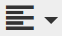
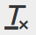
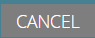

# Using the Rich Text Editor {#using-the-rich-text-editor}

Using the Rich Text Editor - Marketo Docs - Product Documentation

The Rich Text Editor (RTE) appears throughout Marketo and is available whenever you want to add or edit content. You'll see a version of it on landing pages, programs, emails, forms, and snippets. Just click **Edit Draft**, and it'll pop up to serve you.

### What's in this article? {#what-s-in-this-article}

[Editor Settings](#usingtherichtexteditor-editorsettings)  
[Features](#usingtherichtexteditor-features)  
[Landing Pages](#usingtherichtexteditor-landingpages)

#### Editor Settings {#usingtherichtexteditor-editorsettings}

The root block element setting defines which tags wrap your content. By default, the email root block element utilizes 
 tags. You have the option to change that by following the steps below.

>[!TIP]
>
>While you have the option to choose your root block element, we always recommend using default settings for the best user experience.

##### 1. Click Admin. {#usingtherichtexteditor-clickadmin.}

##### 2. Click Email. {#usingtherichtexteditor-clickemail.}

##### 3. Click Edit Text Editor Settings. {#usingtherichtexteditor-clickedittexteditorsettings.}

##### 4. In the Email / Snippet Editor drop-down, select 
 or None and click Save. 
 is used in this example. {#usingtherichtexteditor-intheemail/snippeteditordrop-down-select
ornoneandclicksave.
isusedinthisexample.}

If you have 

 in an Email Template, you will see the following HTML Source behavior when you open the section and type “Text Goes Here” in the editor:

<table class="confluenceTable"> 
 <tbody> 
  <tr> 
   <th>&lt;p&gt;</th> 
   <th>&lt;div&gt;</th> 
   <th>None</th> 
  </tr> 
  <tr> 
   <td>
&lt;div class=“mktEditable”&gt; &lt;p&gt;Text Goes Here&lt;/p&gt; &lt;/div&gt;
</td> 
   <td>
&lt;div class=“mktEditable”&gt; &lt;div&gt;Text Goes Here&lt;/div&gt; &lt;/div&gt;
</td> 
   <td>
&lt;div class=“mktEditable”&gt; Text Goes Here &lt;/div&gt;
</td> 
  </tr> 
 </tbody> 
</table>

>[!TIP]
>
>You can also change the Landing Page Editor's root block element by following the same steps, but clicking the **Landing Page Editor** drop-down in Step 4 instead of Email / Snippet Editor.

>[!NOTE]
>
>The root block element is always 
 for rich-text program tokens.

#### Features {#usingtherichtexteditor-features}

Here are the features you'll find in an RTE.

| Icon |Name |What it does |
|---|---|---|
| 

|Font Family |Choose your style--we've got plenty! |
| 

|Font Size |How big do you want it? 25 choices, from 8px to 90px. |
| 

|Styles |Choose Paragraph or a six Heading styles (for landing pages). |
| 

|Line Spacing |Pick your distance between the lines. |
| 

|Text Color |Black, red, or whatever you want. |
| 

|Background Color |Highlight for emphasis. |
| 

|Bold |**Darker and thicker**. |
| 

|Italic |*Angled, for emphasis or quotation*s. |
| 

|Underline |Puts a line under your text. |
| 

|Alignment |Use this dropdown to lay out your text and images. Center them, choose left or right alignment, or spread it edge to edge with full justification. |
| 

|List |Choose bullets or numbers from the dropdown. Bullets are good with lists and numbers with steps. |
| 

|Indent |Choose more or less indentation. Use for paragraphs or any text you want to stand out. |
| 

|Insert/Edit Link |Put in a link to a website or other content; easily make changes to it. |
| 

|Insert/Edit Image |A picture is worth a thousand words. Drop one in. Click the camera icon to browse your Design Studio. You can drop in images side by side. |
| 

|Insert Token |A powerful tool, great for email personalization and data tracking. Be sure to enter a default value. |
| 

|Undo |Oops! Let's you go back a step and try it again. |
| 

|Redo |If it's really OK as it is, return to the original. |
| 

|Table |Build your own, like this one. A drop-down menu lets you configure it. |
| 

|Insert Anchor |Drop anchor! |
| 

|Horizontal Line |Many uses – Great for dividing sections. |
| 

|Edit HTML |Pops up the HTML Source Editor so you can tweak your code. |
| 

|Subscript |Low-hanging letters (as in O`2`). |
| 

|Superscript |You have the power! (2`6`). |
| 

|Strikethrough |`<s>Put a line through text, like this</s>`. |
| 

|Special Character |Want to talk about euros? Math? You have 243 choices. |
| 

|Find and Replace |Search for and change things much faster than looking for each instance yourself. |
| 

|Clear Formatting |Return things to standard. |
| 

|Cancel |Press the button to say, "Never mind." |
| 

|Save |Press the button to say, "OK, I like it." |

>[!TIP]
>
>`You edit your HTML and text on separate screens. Be sure to click` `**Copy from HTML**` `on the **Text** tab and then **Save** so your text matches your HTML.`

>[!NOTE]
>
>You are not limited to the fonts in the drop-down. You can use one not listed by accessing the HTML code. All web fonts are supported in Marketo, but web fonts do not work universally in all email clients.

#### Landing Pages {#usingtherichtexteditor-landingpages}

The root block element setting defines which tags wrap your content. By default, the landing page root block element utilizes 
 tags. You have the option to change that, by following the steps below.

>[!TIP]
>
>While you have the option to choose your root block element, we always recommend using default settings for the best user experience.

##### 1. Click Admin. {#usingtherichtexteditor-clickadmin..1}

##### 2. Click Email. {#usingtherichtexteditor-clickemail..1}

##### 3. Click Edit Text Editor Settings. {#usingtherichtexteditor-clickedittexteditorsettings..1}

##### 4. In the Landing Page Editor drop-down, select 
 or None and click Save. 
 is used in this example. {#usingtherichtexteditor-inthelandingpageeditordrop-down-select
ornoneandclicksave.
isusedinthisexample.}

And that's it!
