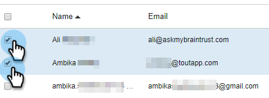

# Create a Sub-Team {#create-a-sub-team}

Create a Sub-Team - Marketo Docs - Product Documentation

### What's in this article? {#what-s-in-this-article}

[Create a Sub-Team](#createasub-team-createasub-team)  
[Add People to Your Sub-Team](#createasub-team-addpeopletoyoursub-team)

#### Create a Sub-Team {#createasub-team-createasub-team}

##### 1. Click the gear icon and select Settings. {#createasub-team-clickthegeariconandselectsettings.}

##### 2. Under Admin Settings, select Team Management. {#createasub-team-underadminsettings-selectteammanagement.}

##### 3. Next to All Teams, click the +.  {#createasub-team-nexttoallteams-clickthe+.}

##### 4. Enter a team name (and optional description) and click Create. {#createasub-team-enterateamname(andoptionaldescription)andclickcreate.}

>[!NOTE]
>
>You can now share templates, campaigns and groups with that team.

#### Add People to Your Sub-Team {#createasub-team-addpeopletoyoursub-team}

##### 1. Still in Team Management, select the Everyone group. {#createasub-team-stillinteammanagement-selecttheeveryonegroup.}

##### 2. Locate the users you want added to your sub-team and select their checkbox. {#createasub-team-locatetheusersyouwantaddedtoyoursub-teamandselecttheircheckbox.}

##### 3. Click Add Selected to Teams. {#createasub-team-clickaddselectedtoteams.}

##### 4. Click the drop-down and select your desired team(s). {#createasub-team-clickthedrop-downandselectyourdesiredteam(s).}

##### 5. Click Add To Teams when done. {#createasub-team-clickaddtoteamswhendone.}

