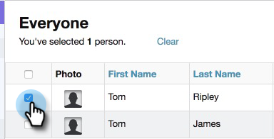

# Add to Marketing Campaign {#add-to-marketing-campaign}

Add to Marketing Campaign - Marketo Docs - Product Documentation

>[!NOTE]
>
>**Prerequisites**
>
>[Make a Campaign Visible to Sales Users](http://docs.marketo.com/x/NwDh)

### What's in this article? {#what-s-in-this-article}

[Add Individuals to a Campaign](#addtomarketingcampaign-addindividualstoacampaign)  
[Add a Group to a Campaign](#addtomarketingcampaign-addagrouptoacampaign)

#### Add Individuals to a Campaign {#addtomarketingcampaign-addindividualstoacampaign}

>[!NOTE]
>
>In order to add a person to a Marketo Campaign from Sales Connect, Sales Connect must have the person's Marketo lead ID. [Learn how to capture Marketo IDs here](http://docs.marketo.com/x/CQXLAQ).

##### 1. Click the People Tab. {#addtomarketingcampaign-clickthepeopletab.}

##### 2. Find the contact(s) you want to add. {#addtomarketingcampaign-findthecontact(s)youwanttoadd.}

##### 3. Click the checkbox to select your contact(s). {#addtomarketingcampaign-clickthecheckboxtoselectyourcontact(s).}

##### 4. Click Add Selected to Campaign. {#addtomarketingcampaign-clickaddselectedtocampaign.}

##### 5. Since you're adding to a Marketing campaign, skip selecting a "from" address. You can however choose to add more contacts. If you choose to, click Individuals and type them in. Click Next when done. {#addtomarketingcampaign-sinceyou'readdingtoamarketingcampaign-skipselectinga"from"address.youcanhoweverchoosetoaddmorecontacts.ifyouchooseto-clickindividualsandtypethemin.clicknextwhendone.}

##### 6. Click Marketing Campaign. {#addtomarketingcampaign-clickmarketingcampaign.}

##### 7. Click the Workspaces drop-down and choose the workspace that contains the campaign you want the group added to. {#addtomarketingcampaign-clicktheworkspacesdrop-downandchoosetheworkspacethatcontainsthecampaignyouwantthegroupaddedto.}

>[!NOTE]
>
>If you don't see the workspace you want, make sure your Admin provisions it through your Marketo Team Access page.

##### 8. Select the desired campaign and click Next. {#addtomarketingcampaign-selectthedesiredcampaignandclicknext.}

##### 9. You're shown the contacts that qualify. Click Start to get them added. {#addtomarketingcampaign-you'reshownthecontactsthatqualify.clickstarttogetthemadded.}

#### Add a Group to a Campaign {#addtomarketingcampaign-addagrouptoacampaign}

##### 1. Click the People Tab. {#addtomarketingcampaign-clickthepeopletab..1}

##### 2. Under My Groups, select the group you wish to add to a campaign. {#addtomarketingcampaign-undermygroups-selectthegroupyouwishtoaddtoacampaign.}

##### 3. Click Add Group to Campaign. {#addtomarketingcampaign-clickaddgrouptocampaign.}

##### 4. Since you're adding to a Marketing campaign, skip selecting a "from" address. You can however choose to add more contacts. If you choose to, click Individuals and type them in. Click Next when done. {#addtomarketingcampaign-sinceyou'readdingtoamarketingcampaign-skipselectinga"from"address.youcanhoweverchoosetoaddmorecontacts.ifyouchooseto-clickindividualsandtypethemin.clicknextwhendone..1}

##### 5. Select Marketing Campaign. {#addtomarketingcampaign-selectmarketingcampaign.}

>[!NOTE]
>
>In order to add a person to a Marketo Campaign from Sales Connect, Sales Connect must have the person's Marketo lead ID. [Learn how to capture Marketo IDs here](http://docs.marketo.com/x/CQXLAQ).

##### 6. Click the Workspaces drop-down and choose the workspace that contains the campaign you want the group added to. {#addtomarketingcampaign-clicktheworkspacesdrop-downandchoosetheworkspacethatcontainsthecampaignyouwantthegroupaddedto..1}

>[!NOTE]
>
>If you don't see the workspace you want, make sure your Admin provisions it through your Marketo Team Access page.

##### 7. Select the desired campaign and click Next. {#addtomarketingcampaign-selectthedesiredcampaignandclicknext..1}

##### 8. You're shown the contacts that qualify. Click Start to get them added. {#addtomarketingcampaign-you'reshownthecontactsthatqualify.clickstarttogetthemadded..1}

